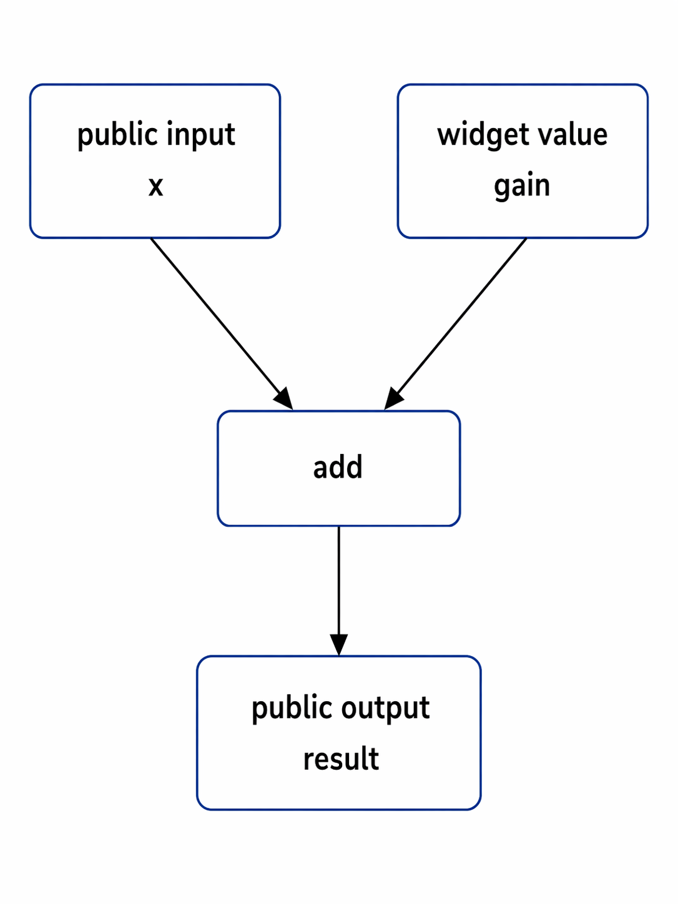

  

<h1>Conformance Case — 05 Public Interface and Widget Participation Distinct</h1>

<strong>Valid conformance case for preserving the distinction between public interface participation and widget-owned value participation in FROG v0.1</strong> 
FROG — Free Open Graphical Language

<h2>Contents</h2>
<ul>
  <li><a href="#overview">1. Overview</a></li>
  <li><a href="#expected-status">2. Expected Status</a></li>
  <li><a href="#illustrative-source-shape">3. Illustrative Source Shape</a></li>
  <li><a href="#semantic-intent">4. Semantic Intent</a></li>
  <li><a href="#boundaries-exercised">5. Boundaries Exercised</a></li>
  <li><a href="#why-the-case-is-valid">6. Why the Case Is Valid</a></li>
  <li><a href="#expected-validation-outcome">7. Expected Validation Outcome</a></li>
  <li><a href="#expected-semantic-preservation">8. Expected Semantic Preservation</a></li>
  <li><a href="#expected-ir-and-backend-preservation">9. Expected IR and Backend Preservation</a></li>
  <li><a href="#forbidden-reinterpretations">10. Forbidden Reinterpretations</a></li>
  <li><a href="#summary">11. Summary</a></li>
</ul>

<h2 id="overview">1. Overview</h2>

This conformance case defines a minimal valid program in which a public interface input and a front-panel widget value both participate in the same executable graph without semantic collapse.

The case intentionally stays small. Its purpose is not to introduce a richer UI model, an event model, or property-driven object interaction. Its purpose is to confirm that a conforming FROG toolchain accepts coexistence between:

<ul>
  <li>a public interface boundary, and</li>
  <li>a widget-owned value contribution.</li>
</ul>

The conceptual shape is:

  

<pre><code>public input         widget value
     x                   gain
      \                 /
       \               /
        \             /
         +-- add ----+
               |
               v
         public output
             result
</code></pre>

This case is valid only if the following distinction remains explicit:

<pre><code>interface_input(x) != widget_value(gain)
</code></pre>

<h2 id="expected-status">2. Expected Status</h2>

<strong>Expected:</strong> valid

A conforming implementation should accept this case as a valid FROG program shape in the published v0.1 architecture.

<h2 id="illustrative-source-shape">3. Illustrative Source Shape</h2>

This case is defined as a specification-level conformance case.

It is not currently tied to a mandatory published executable slice in <code>Examples/</code>.

An illustrative source shape would include:

<ul>
  <li>one interface input named <code>x</code>,</li>
  <li>one front-panel numeric control named <code>gain</code>,</li>
  <li>one diagram-side <code>interface_input</code> participation node for <code>x</code>,</li>
  <li>one diagram-side <code>widget_value</code> participation node for <code>gain</code>,</li>
  <li>one arithmetic primitive <code>frog.core.add</code>,</li>
  <li>one diagram-side <code>interface_output</code> participation node for <code>result</code>.</li>
</ul>

The minimal participation model is therefore:

<pre><code>public contract input      -> x
widget-owned value input   -> gain
computation                -> frog.core.add
public contract output     -> result
</code></pre>

<h2 id="semantic-intent">4. Semantic Intent</h2>

The minimal semantic intent is:

<pre><code>result = x + gain
</code></pre>

This intent is simple, but the architectural point is not the arithmetic itself. The real point is that the two incoming values do not have the same ownership category.

One value enters the program through the public callable interface. 
The other value enters the executable graph through widget-owned value participation.

Both values may lawfully feed the same computation. 
They must not become semantically interchangeable.

<h2 id="boundaries-exercised">5. Boundaries Exercised</h2>

<ul>
  <li>public interface declaration,</li>
  <li>front-panel widget declaration,</li>
  <li>diagram-side <code>interface_input</code> participation,</li>
  <li>diagram-side <code>widget_value</code> participation,</li>
  <li>diagram-side <code>interface_output</code> participation,</li>
  <li>ordinary arithmetic primitive execution through <code>frog.core.add</code>,</li>
  <li>type-compatible value flow across mixed participation categories,</li>
  <li>preservation of the distinction between public contract participation and widget-owned value participation.</li>
</ul>

The key architectural boundary exercised by this case is:

<pre><code>public interface participation
              !=
widget-owned value participation
</code></pre>

<h2 id="why-the-case-is-valid">6. Why the Case Is Valid</h2>

This case is valid because:

<ul>
  <li>the public interface input is well formed and remains part of the public program contract,</li>
  <li>the public interface output is well formed and remains part of the public program contract,</li>
  <li>the front-panel widget declaration is well formed and remains widget-owned UI state,</li>
  <li>the diagram-side <code>widget_value</code> participation refers to an existing value-carrying widget,</li>
  <li>the arithmetic primitive is ordinary executable computation over compatible values,</li>
  <li>the graph is acyclic,</li>
  <li>the case does not require explicit local memory,</li>
  <li>the case does not require <code>widget_reference</code>,</li>
  <li>the case does not require property-based interaction,</li>
  <li>the case does not require event semantics.</li>
</ul>

The essential point is that the program is meaningful without forcing one category to masquerade as the other.

<h2 id="expected-validation-outcome">7. Expected Validation Outcome</h2>

A conforming validator should accept this case and establish valid language-level meaning.

At minimum, validation should confirm that:

<ul>
  <li>the source is structurally valid canonical FROG source,</li>
  <li>the interface input declaration is valid,</li>
  <li>the interface output declaration is valid,</li>
  <li>the front-panel widget declaration is valid,</li>
  <li>the selected widget class is value-carrying,</li>
  <li>the widget <code>value_type</code> is valid,</li>
  <li>the diagram-side <code>interface_input</code> participation refers to an actual public input,</li>
  <li>the diagram-side <code>widget_value</code> participation refers to an actual widget,</li>
  <li>the primitive reference <code>frog.core.add</code> is valid,</li>
  <li>the connected value flow is type-compatible,</li>
  <li>the diagram-side <code>interface_output</code> participation is well formed,</li>
  <li>no illegal cycle is present,</li>
  <li>no explicit-memory rule is needed,</li>
  <li>no object-style widget interaction is implied.</li>
</ul>

The validation result should therefore establish a valid program containing both:

<pre><code>public contract participation
and
widget-owned value participation
</code></pre>

without merging those roles.

<h2 id="expected-semantic-preservation">8. Expected Semantic Preservation</h2>

Once validated, the program meaning should preserve at least the following distinctions:

<ul>
  <li><code>interface_input(x)</code> remains public contract participation,</li>
  <li><code>widget_value(gain)</code> remains widget-owned value participation,</li>
  <li><code>interface_output(result)</code> remains public contract output participation,</li>
  <li>the arithmetic operation remains ordinary primitive computation,</li>
  <li>the two incoming values remain attributable to different source-side ownership categories.</li>
</ul>

The preserved distinction is conceptually:

<pre><code>source-side role A: interface_input(x)
source-side role B: widget_value(gain)

A != B
A and B may feed the same computation
</code></pre>

This case is therefore not only about acceptance. It is also about preserving the correct semantic reading after validation.

<h2 id="expected-ir-and-backend-preservation">9. Expected IR and Backend Preservation</h2>

If execution-facing IR is derived from this case, derivation should preserve explicitly:

<ul>
  <li>public entry participation for input <code>x</code>,</li>
  <li>widget-owned value participation for <code>gain</code>,</li>
  <li>primitive execution identity for <code>frog.core.add</code>,</li>
  <li>public exit participation for output <code>result</code>,</li>
  <li>the dependency relations between those elements,</li>
  <li>recoverable attribution showing that the two incoming values do not originate from the same source-side role.</li>
</ul>

If the program is later lowered into a backend contract, that contract should still preserve that:

<ul>
  <li>one input originates at the public callable boundary,</li>
  <li>one input originates from widget-owned value participation,</li>
  <li>the computation is arithmetic addition,</li>
  <li>the result exits through a public output boundary,</li>
  <li>no object-style widget reference handling is required,</li>
  <li>no hidden event model is required,</li>
  <li>no explicit local-memory semantics are required.</li>
</ul>

A backend family may specialize realization details, but it must not erase the distinction between:

<pre><code>public interface argument
and
widget-sourced value contribution
</code></pre>

<h2 id="forbidden-reinterpretations">10. Forbidden Reinterpretations</h2>

A conforming implementation must not reinterpret this case in any of the following ways:

<ul>
  <li>as if the widget declaration automatically created a public interface port,</li>
  <li>as if the public interface input were just another widget,</li>
  <li>as if the widget contribution required <code>widget_reference</code>,</li>
  <li>as if the widget contribution were property access to widget member <code>value</code>,</li>
  <li>as if coexistence between public interface participation and widget participation were invalid by itself,</li>
  <li>as if the case implicitly introduced state,</li>
  <li>as if the case implicitly introduced event semantics,</li>
  <li>as if both incoming values could be silently normalized into one generic endpoint category while still preserving conformance.</li>
</ul>

The forbidden collapses can be summarized as:

<pre><code>interface_input   -/-> widget_value
widget_value      -/-> public interface port
widget_value      -/-> widget_reference
simple value flow -/-> hidden event semantics
acyclic graph     -/-> implicit state
</code></pre>

<h2 id="summary">11. Summary</h2>

This is the baseline valid conformance case for coexistence without collapse between:

<ul>
  <li>public interface participation, and</li>
  <li>widget-owned value participation.</li>
</ul>

A conforming toolchain should:

<ul>
  <li>accept the case,</li>
  <li>validate it as a meaningful program,</li>
  <li>preserve the distinction between the two participation categories,</li>
  <li>derive execution-facing representation without semantic collapse,</li>
  <li>preserve through backend handoff that both categories may coexist in one executable graph while remaining distinct.</li>
</ul>

The essential preservation rule is:

<pre><code>public interface participation
            !=
widget-owned value participation
</code></pre>
