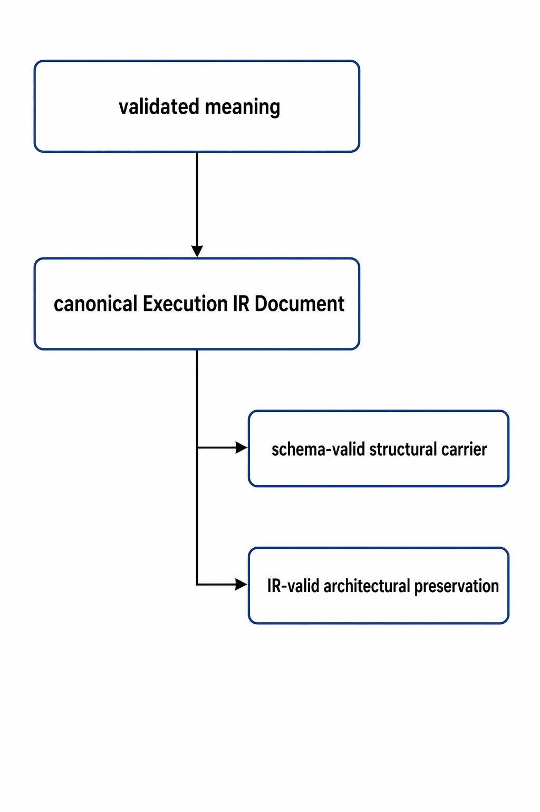

  

<h1 align="center">FROG Conformance Case 53</h1>

  <strong>Schema-valid canonical IR must still preserve IR architectural distinctions</strong> 
  <em>FROG — Free Open Graphical Language</em>

<h2>Contents</h2>
<ul>
  <li><a href="#case-name">1. Case Name</a></li>
  <li><a href="#expected">2. Expected</a></li>
  <li><a href="#why">3. Why</a></li>
  <li><a href="#boundary-being-exercised">4. Boundary Being Exercised</a></li>
  <li><a href="#scenario">5. Scenario</a></li>
  <li><a href="#what-makes-the-case-valid">6. What Makes the Case Valid</a></li>
  <li><a href="#expected-ir-reading">7. Expected IR Reading</a></li>
  <li><a href="#expected-preservation">8. Expected Preservation</a></li>
  <li><a href="#what-must-not-happen">9. What Must Not Happen</a></li>
  <li><a href="#rationale">10. Rationale</a></li>
  <li><a href="#minimum-conformance-reading">11. Minimum Conformance Reading</a></li>
</ul>

<h2 id="case-name">1. Case Name</h2>

Case:
<code>53_schema_valid_canonical_ir_must_still_preserve_ir_architectural_distinctions</code>

<h2 id="expected">2. Expected</h2>

<strong>Expected:</strong> valid

<strong>Expected loadability:</strong> loadable

<strong>Expected structural validity:</strong> valid

<strong>Expected meaning:</strong> established

<strong>Expected IR result:</strong> derivable

<strong>Expected IR schema result:</strong> schema-valid

<strong>Expected IR architectural result:</strong> valid

<strong>Expected preservation:</strong>
the canonical Execution IR is not only schema-valid but also preserves the architectural distinctions required by the published IR layer.

<h2 id="why">3. Why</h2>

This case exists to make one rule explicit:

<pre><code>schema-valid IR
      does not replace
IR architectural validity

but

conforming IR
      may and should be
both schema-valid and IR-valid
</code></pre>

The purpose of this case is positive:
it shows that the canonical JSON carrier discipline and the architectural IR discipline are compatible and intended to coexist.

<h2 id="boundary-being-exercised">4. Boundary Being Exercised</h2>

This case exercises the boundary across:

  

<pre><code>validated meaning
      |
      v
canonical Execution IR Document
      |
      +-- schema-valid structural carrier
      |
      +-- IR-valid architectural preservation
</code></pre>

The distinction under test is:

<ul>
  <li>machine-checkable structural validity, and</li>
  <li>architectural correctness of the canonical open IR.</li>
</ul>

<h2 id="scenario">5. Scenario</h2>

A valid FROG program derives to canonical Execution IR whose JSON payload:

<ul>
  <li>matches the published schema family,</li>
  <li>contains the expected top-level document and execution-unit categories,</li>
  <li>contains explicit objects, connections, regions, attribution, and correspondence carriers where applicable,</li>
  <li>and also preserves the distinctions required by the IR layer.</li>
</ul>

Examples of such distinctions include:

<ul>
  <li>primary versus support object role,</li>
  <li><code>widget_value</code> versus <code>widget_reference</code>,</li>
  <li>public boundary participation versus UI participation,</li>
  <li>structured control versus flattened private machinery,</li>
  <li>intentional non-primary correspondence versus accidental omission.</li>
</ul>

<h2 id="what-makes-the-case-valid">6. What Makes the Case Valid</h2>

This case is valid because all of the following are true at once:

<ul>
  <li>the source is valid,</li>
  <li>semantic meaning is established,</li>
  <li>the canonical IR is derivable and constructed correctly,</li>
  <li>the emitted canonical JSON matches the published schema posture,</li>
  <li>the emitted IR also preserves the architectural distinctions required by the IR documents.</li>
</ul>

The point of the case is:

<pre><code>schema-valid
    and
architecturally faithful
</code></pre>

not:

<pre><code>schema-valid
    instead of
architecturally faithful
</code></pre>

<h2 id="expected-ir-reading">7. Expected IR Reading</h2>

A conforming reading of this case should allow all of the following to be true together:

<ul>
  <li>the payload is structurally acceptable against the published schema family,</li>
  <li>the object families remain classifiable,</li>
  <li>required source attribution remains explicit,</li>
  <li>required correspondence remains explicit where relevant,</li>
  <li>required structure identity, boundary identity, and memory identity remain recoverable.</li>
</ul>

A simplified acceptable reading is:

<pre><code>canonical JSON payload
      +
explicit object families
      +
explicit connectivity
      +
explicit attribution / correspondence
      +
recoverable architectural distinctions
</code></pre>

<h2 id="expected-preservation">8. Expected Preservation</h2>

A conforming implementation must preserve all of the following:

<ul>
  <li>schema-visible category presence,</li>
  <li>IR-side family classification,</li>
  <li>identity and attribution recoverability,</li>
  <li>non-primary correspondence where required,</li>
  <li>architectural distinctions that remain normative at the open IR boundary.</li>
</ul>

At minimum, this case requires the implementation to avoid treating schema validation as the only correctness criterion.

<h2 id="what-must-not-happen">9. What Must Not Happen</h2>

A conforming implementation must not read this case as permission to:

<ul>
  <li>reduce IR correctness to schema acceptance only,</li>
  <li>erase IR architectural distinctions once the JSON shape passes validation,</li>
  <li>treat carrier presence alone as proof of architectural faithfulness,</li>
  <li>replace recoverable IR structure with implementation-private assumptions while still claiming canonical IR validity.</li>
</ul>

<h2 id="rationale">10. Rationale</h2>

This case matters because the FROG IR layer is explicitly multi-layered:

<ul>
  <li><code>Schema.md</code> and <code>IR/schema/</code> define structural machine-checkable validation,</li>
  <li><code>Execution IR.md</code>, <code>Derivation rules.md</code>, <code>Construction rules.md</code>, and <code>Identity and Mapping.md</code> define architectural obligations that go beyond JSON shape alone.</li>
</ul>

Conformance must therefore show not only what fails, but also what correct layered alignment looks like.

<h2 id="minimum-conformance-reading">11. Minimum Conformance Reading</h2>

A minimal conforming reading of this case is:

<ul>
  <li>the source is valid,</li>
  <li>semantic meaning is established,</li>
  <li>the IR payload is schema-valid,</li>
  <li>the IR remains architecturally faithful,</li>
  <li>schema-validity is read as one required layer, not as the whole meaning of IR correctness.</li>
</ul>

The public truth asserted by this case is:

<pre><code>conforming canonical IR
        may be
schema-valid
        and
architecturally valid

and must not collapse one into the other
</code></pre>
