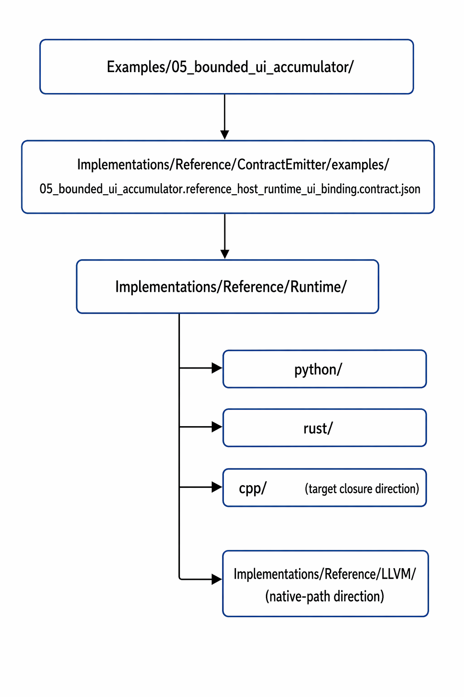

  

<h1 align="center">FROG Examples</h1>

  <strong>Illustrative named slices and executable example dossiers of the published FROG specification</strong> 
  <em>FROG — Free Open Graphical Language</em>

<h2>Contents</h2>
<ul>
  <li><a href="#overview">1. Overview</a></li>
  <li><a href="#why-this-directory-exists">2. Why This Directory Exists</a></li>
  <li><a href="#what-examples-are">3. What Examples Are</a></li>
  <li><a href="#what-examples-are-not">4. What Examples Are Not</a></li>
  <li><a href="#closure-direction">5. Closure Direction</a></li>
  <li><a href="#relation-with-conformance">6. Relation with Conformance</a></li>
  <li><a href="#relation-with-fir-lowering-runtime-and-native-paths">7. Relation with FIR, Lowering, Runtime, and Native Paths</a></li>
  <li><a href="#published-example-families">8. Published Example Families</a></li>
  <li><a href="#useful-file-tree">9. Useful File Tree</a></li>
  <li><a href="#file-responsibilities">10. File Responsibilities</a></li>
  <li><a href="#core-language-example-slices">11. Core Language Example Slices</a></li>
  <li><a href="#applicative-vertical-slice-anchor">12. Applicative Vertical-Slice Anchor</a></li>
  <li><a href="#compiler-corridor-positive-mirror">13. Compiler-Corridor Positive Mirror</a></li>
  <li><a href="#reading-discipline">14. Reading Discipline</a></li>
  <li><a href="#growth-discipline">15. Growth Discipline</a></li>
  <li><a href="#summary">16. Summary</a></li>
</ul>

<h2 id="overview">1. Overview</h2>

This directory provides illustrative named slices of the published FROG specification.
It also increasingly serves as the repository-visible entry point for <strong>serious executable example dossiers</strong>.

Examples exist to make the repository easier to read across layers.
They give readers compact, recognizable cases that can be followed across canonical source structure, semantic interpretation, FIR consequences, lowering posture, backend contract posture, runtime-family consumption, and native-path direction where such a corridor is already published.

Examples are therefore part of the repository-visible reading corridor,
but they are not independent semantic owners.
They remain subordinate to the published ownership boundaries of the specification.

<h2 id="why-this-directory-exists">2. Why This Directory Exists</h2>

A specification stack becomes easier to understand when readers can inspect small named slices that correspond to recognizable architectural situations.

Examples therefore exist to:

<ul>
  <li>illustrate published source structures,</li>
  <li>illustrate published semantic boundaries,</li>
  <li>illustrate published FIR consequences,</li>
  <li>illustrate lowering and backend handoff posture,</li>
  <li>illustrate declared runtime-consumer corridors where published,</li>
  <li>illustrate native-path direction where applicable,</li>
  <li>make repository-visible vertical slices easier to discuss across documents.</li>
</ul>

<h2 id="what-examples-are">3. What Examples Are</h2>

Examples are illustrative repository-visible slices.
They are intentionally small, focused, named, and architecture-oriented.

An example may illustrate:

<ul>
  <li>a canonical source shape,</li>
  <li>a semantic pattern,</li>
  <li>a control pattern,</li>
  <li>a state pattern,</li>
  <li>a front-panel interaction pattern,</li>
  <li>a FIR-relevant derivation situation,</li>
  <li>a lowering or backend-handoff situation,</li>
  <li>a bounded execution-facing reference path where such a path is already published.</li>
</ul>

<h2 id="what-examples-are-not">4. What Examples Are Not</h2>

Examples do not become hidden semantic law.

<pre><code>Specification defines
Conformance exposes public expectations
Examples illustrate and document closure state
</code></pre>

An example therefore does not replace the owning documents in:

<ul>
  <li><code>Expression/</code>,</li>
  <li><code>Language/</code>,</li>
  <li><code>Libraries/</code>,</li>
  <li><code>IR/</code>,</li>
  <li><code>Profiles/</code>,</li>
  <li><code>IDE/</code> where IDE-facing behavior is concerned.</li>
</ul>

<h2 id="closure-direction">5. Closure Direction</h2>

The repository direction for serious examples is now explicit:
a serious example should progressively converge toward <strong>A-to-Z inspectability</strong>.

That does not mean every example is already fully closed.
It means each serious example dossier should make visible:

<ul>
  <li>what the example does,</li>
  <li>where the canonical <code>.frog</code> source lives,</li>
  <li>where the front-panel posture lives,</li>
  <li>where a peripheral UI object file should live when applicable,</li>
  <li>where the FIR posture lives,</li>
  <li>where the lowering posture lives,</li>
  <li>where the backend contract lives,</li>
  <li>how Python, Rust, and C/C++ runtime paths do or do not exist yet,</li>
  <li>and whether an LLVM-oriented native path exists yet.</li>
</ul>

Accordingly, example README files should not remain abstract descriptions only.
They should function as <strong>operational dossiers</strong>.

<h2 id="relation-with-conformance">6. Relation with Conformance</h2>

Examples and conformance are related but distinct.

<ul>
  <li><strong>Examples</strong> illustrate named slices and document closure posture.</li>
  <li><strong>Conformance</strong> exposes accept / reject / preserve truth.</li>
</ul>

A useful reading model is:

<pre><code>example slice
   -&gt;
conformance expectation
   -&gt;
FIR / lowering reading where relevant
   -&gt;
runtime-family and native-path reading where published
</code></pre>

<h2 id="relation-with-fir-lowering-runtime-and-native-paths">7. Relation with FIR, Lowering, Runtime, and Native Paths</h2>

Examples may mirror:

<ul>
  <li>core source / semantic slices,</li>
  <li>FIR-relevant slices,</li>
  <li>lowering-relevant slices,</li>
  <li>runtime-family corridors,</li>
  <li>native compiler-oriented corridors where declared.</li>
</ul>

The ownership model remains explicit:

<pre><code>Examples
   -&gt; illustrate and expose closure state

Conformance
   -&gt; expose public expectations

IR
   -&gt; define canonical execution-facing law

Implementations/Reference/Runtime
   -&gt; consume the published corridor in runtime families

Implementations/Reference/LLVM
   -&gt; consume lowered forms in a native compiler-oriented corridor
</code></pre>

<h2 id="published-example-families">8. Published Example Families</h2>

Published example growth should remain small, architecture-first, and repository-coherent.

At the current published state, this directory contains two complementary public reading surfaces:

<ul>
  <li>a sequence of numbered named slices under <code>Examples/01_*</code> through <code>Examples/05_*</code>,</li>
  <li>and a conservative compiler-corridor positive mirror under <code>Examples/compiler/</code>.</li>
</ul>

<h2 id="useful-file-tree">9. Useful File Tree</h2>

<pre><code>Examples/
├── Readme.md
├── 01_pure_addition/
├── 02_ui_value_roundtrip/
├── 03_ui_property_write/
├── 04_stateful_feedback_delay/
├── 05_bounded_ui_accumulator/
│   ├── Readme.md
│   └── main.frog
└── compiler/
    ├── 01_pure_arithmetic.md
    ├── 02_structured_control.md
    └── 03_explicit_state.md
</code></pre>

<h2 id="file-responsibilities">10. File Responsibilities</h2>

<ul>
  <li><code>Examples/Readme.md</code> 
      Directory-level entry point for the example surface. It explains what examples are for, how they should be read, and how serious examples should expose closure status.</li>
  <li><code>Examples/01_pure_addition/</code> 
      Minimal arithmetic source slice used to illustrate a first simple dataflow corridor.</li>
  <li><code>Examples/02_ui_value_roundtrip/</code> 
      Slice used to introduce basic front-panel value participation.</li>
  <li><code>Examples/03_ui_property_write/</code> 
      Slice used to introduce bounded object-style UI property access.</li>
  <li><code>Examples/04_stateful_feedback_delay/</code> 
      Slice used to introduce explicit local memory and bounded feedback through delay.</li>
  <li><code>Examples/05_bounded_ui_accumulator/</code> 
      First serious applicative vertical-slice dossier, currently the main source → contract → runtime example anchor.</li>
  <li><code>Examples/compiler/</code> 
      Conservative compiler-oriented reading mirror that remains narrower than the applicative example dossiers.</li>
</ul>

<h2 id="core-language-example-slices">11. Core Language Example Slices</h2>

The currently published numbered slices are:

<pre><code>Examples/
├── 01_pure_addition/
├── 02_ui_value_roundtrip/
├── 03_ui_property_write/
├── 04_stateful_feedback_delay/
└── 05_bounded_ui_accumulator/
</code></pre>

Taken together, these slices expose a useful progression:

<ul>
  <li><strong>01_pure_addition</strong> keeps the first reading corridor centered on simple dataflow computation,</li>
  <li><strong>02_ui_value_roundtrip</strong> introduces front-panel value participation without opening object-style UI access yet,</li>
  <li><strong>03_ui_property_write</strong> introduces bounded object-style property-write participation,</li>
  <li><strong>04_stateful_feedback_delay</strong> introduces explicit state through a bounded feedback / delay pattern,</li>
  <li><strong>05_bounded_ui_accumulator</strong> combines front-panel participation, bounded iteration, explicit state, public output, published backend handoff, and published runtime consumption posture in one coherent applicative slice.</li>
</ul>

<h2 id="applicative-vertical-slice-anchor">12. Applicative Vertical-Slice Anchor</h2>

The first repository-visible applicative vertical-slice anchor is:

<pre><code>Examples/05_bounded_ui_accumulator/</code></pre>

This slice matters because it is the first published example in this directory that intentionally touches multiple major layers in one bounded corridor, including:

<ul>
  <li>canonical source structure,</li>
  <li>public interface participation,</li>
  <li>front-panel participation,</li>
  <li>simple widget-value use,</li>
  <li>minimal widget-reference use,</li>
  <li>bounded loop behavior,</li>
  <li>explicit state,</li>
  <li>observable final output,</li>
  <li>a published backend contract artifact,</li>
  <li>and published downstream runtime-family consumers.</li>
</ul>

The intended bounded reading corridor is therefore:

  

<pre><code>Examples/05_bounded_ui_accumulator/
      |
      v
Implementations/Reference/ContractEmitter/examples/
05_bounded_ui_accumulator.reference_host_runtime_ui_binding.contract.json
      |
      v
Implementations/Reference/Runtime/
      +-- python/
      +-- rust/
      \-- cpp/            (target closure direction)
      |
      \-- Implementations/Reference/LLVM/  (native-path direction)
</code></pre>

<h2 id="compiler-corridor-positive-mirror">13. Compiler-Corridor Positive Mirror</h2>

The conservative compiler-oriented mirror remains:

<pre><code>Examples/compiler/
├── 01_pure_arithmetic.md
├── 02_structured_control.md
└── 03_explicit_state.md
</code></pre>

These examples correspond to a narrower positive corridor centered on:

<ul>
  <li><strong>pure computation</strong>,</li>
  <li><strong>structured control</strong>,</li>
  <li><strong>explicit state</strong>.</li>
</ul>

<h2 id="reading-discipline">14. Reading Discipline</h2>

Examples should normally be read together with their neighboring ownership and support layers.

A practical reading order is:

<pre><code>example
   -&gt;
owning Expression / Language documents
   -&gt;
IR documents where execution-facing consequences matter
   -&gt;
Conformance expectations
   -&gt;
Reference runtime-family consumers where published
   -&gt;
LLVM-oriented native path posture where declared
</code></pre>

<h2 id="growth-discipline">15. Growth Discipline</h2>

Future example growth should remain disciplined.
New example families should be added when they close a meaningful repository-visible corridor rather than merely increasing surface area.

The preferred direction is therefore:

<pre><code>close one coherent source slice
   -&gt;
close one serious example dossier
   -&gt;
publish backend handoff
   -&gt;
align Python / Rust / C/C++ runtime consumers
   -&gt;
align LLVM-native direction where applicable
   -&gt;
only then broaden the next example family
</code></pre>

<h2 id="summary">16. Summary</h2>

Examples are illustrative named slices of the specification.
They remain subordinate to the owning specification documents and complementary to conformance, FIR / lowering, runtime-family consumers, and the non-normative reference implementation workspace.

The published example surface now has two complementary forms:

<ul>
  <li>a numbered slice progression from <code>01_pure_addition</code> through <code>05_bounded_ui_accumulator</code>,</li>
  <li>and a conservative compiler-oriented positive mirror under <code>Examples/compiler/</code>.</li>
</ul>

Among these, <code>05_bounded_ui_accumulator</code> is currently the primary applicative vertical-slice anchor because it is the first bounded example that visibly combines front-panel participation, bounded iteration, explicit state, public output, a published backend contract artifact, and published runtime-family consumer surfaces in one named corridor.

