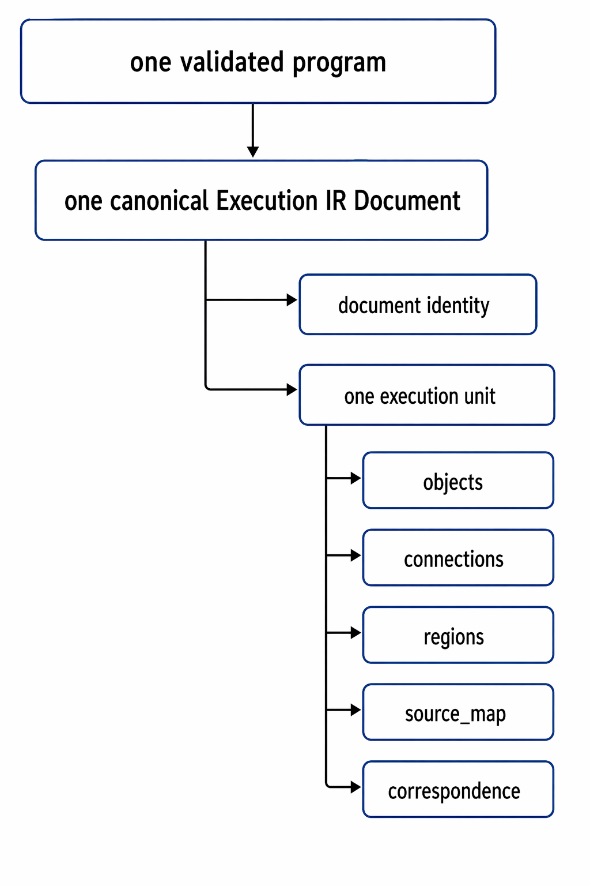

  

<h1 align="center">FROG IR Construction Rules</h1>

  <strong>Normative construction rules for building the canonical Execution IR Document from validated FROG program meaning</strong> 
  <em>FROG — Free Open Graphical Language</em>

<h2>Contents</h2>
<ul>
  <li><a href="#overview">1. Overview</a></li>
  <li><a href="#reading-legend">2. Reading Legend</a></li>
  <li><a href="#scope-of-this-document">3. Scope of this Document</a></li>
  <li><a href="#relation-with-other-specifications">4. Relation with Other Specifications</a></li>
  <li><a href="#construction-entry-condition">5. Construction Entry Condition</a></li>
  <li><a href="#construction-result">6. Construction Result</a></li>
  <li><a href="#construction-principles">7. Construction Principles</a></li>
  <li><a href="#construction-pipeline">8. Construction Pipeline</a></li>
  <li><a href="#execution-ir-document-construction">9. Execution IR Document Construction</a></li>
  <li><a href="#execution-unit-construction">10. Execution Unit Construction</a></li>
  <li><a href="#primary-object-construction">11. Primary Object Construction</a></li>
  <li><a href="#port-terminal-and-connection-construction">12. Port, Terminal, and Connection Construction</a></li>
  <li><a href="#region-and-structure-construction">13. Region and Structure Construction</a></li>
  <li><a href="#boundary-and-ui-construction">14. Boundary and UI Construction</a></li>
  <li><a href="#widget-object-construction-corridor">15. Widget Object Construction Corridor</a></li>
  <li><a href="#state-and-cycle-construction">16. State and Cycle Construction</a></li>
  <li><a href="#source-attribution-and-correspondence-construction">17. Source Attribution and Correspondence Construction</a></li>
  <li><a href="#support-object-construction">18. Support Object Construction</a></li>
  <li><a href="#non-primary-correspondence-handling">19. Non-Primary Correspondence Handling</a></li>
  <li><a href="#canonical-json-payload-shape">20. Canonical JSON Payload Shape</a></li>
  <li><a href="#ir-validity-checks">21. IR Validity Checks</a></li>
  <li><a href="#determinism-and-stability">22. Determinism and Stability</a></li>
  <li><a href="#out-of-scope-for-v01">23. Out of Scope for v0.1</a></li>
  <li><a href="#summary">24. Summary</a></li>
</ul>

<h2 id="overview">1. Overview</h2>

This document defines how a conforming implementation constructs the canonical Execution IR Document from validated FROG program meaning in base v0.1.

Where <code>IR/Derivation rules.md</code> defines what must correspond between validated meaning and the canonical Execution IR, this document defines how that corresponding IR is materially built in a way that remains:

<ul>
  <li>conservative,</li>
  <li>attributable,</li>
  <li>structured,</li>
  <li>portable,</li>
  <li>schema-checkable,</li>
  <li>suitable for later lowering.</li>
</ul>

This document does not standardize one private compiler pipeline. It standardizes the construction obligations that make the produced Execution IR recognizable, inspectable, recoverable, serializable, and suitable for later specialization.

<pre><code>validated program meaning
        |
        v
construction rules   &lt;-- this document
        |
        v
canonical Execution IR Document
        |
        v
lowering / specialization
        |
        v
backend-facing contract
        |
        v
private realization</code></pre>

In base v0.1, construction is intentionally conservative. It builds:

<ul>
  <li>primary execution-facing objects for execution-relevant validated content,</li>
  <li>support objects only when they make already-validated execution-facing structure explicit,</li>
  <li>recoverable correspondence for source-visible content that does not become a primary execution object in the open IR,</li>
  <li>one canonical JSON-serializable Execution IR Document for one validated program.</li>
</ul>

This conservatism applies directly to widget-related execution structure:

<ul>
  <li>construction may preserve execution-facing widget roles,</li>
  <li>construction must not materialize host-private widget realization as if it were canonical open IR.</li>
</ul>

<h2 id="reading-legend">2. Reading Legend</h2>

<ul>
  <li>Open specification-facing representation or layer</li>
  <li>Semantic truth, source attribution, or recoverability obligation</li>
  <li>Boundary, interface, mapping, or standardized construction handoff</li>
  <li>Lowering / specialization / target adaptation zone</li>
  <li>Implementation-private or runtime-private realization zone</li>
</ul>

<h2 id="scope-of-this-document">3. Scope of this Document</h2>

This document defines:

<ul>
  <li>the construction entry condition,</li>
  <li>the minimum construction stages of the canonical Execution IR Document,</li>
  <li>the obligations for building the top-level IR document and its single execution unit,</li>
  <li>the obligations for building primary objects, support objects, ports, terminals, connections, and regions,</li>
  <li>the obligations for building explicit source attribution and correspondence records,</li>
  <li>the conditions under which support objects MAY be introduced,</li>
  <li>the canonical JSON payload categories that a conforming implementation MUST be able to emit,</li>
  <li>the minimum validity properties of the constructed IR document.</li>
</ul>

This document does not fully define:

<ul>
  <li>the canonical source representation,</li>
  <li>the semantic meaning of language constructs,</li>
  <li>the full cross-stage identity model,</li>
  <li>backend-specific lowering or runtime-private realization,</li>
  <li>the full field-by-field machine-checkable schema,</li>
  <li>the full widget-package architecture,</li>
  <li>the full host realization model.</li>
</ul>

<pre><code>This document defines:
how a conforming canonical open IR document is materially built

This document does not define:
source shape
language semantics
full cross-stage identity contract
lowering
private realization
full schema text
widget-package ownership
host realization ownership</code></pre>

<h2 id="relation-with-other-specifications">4. Relation with Other Specifications</h2>

This document depends on the following ownership boundaries:

<ul>
  <li><code>Expression/</code> owns canonical source structure and source-visible object presence.</li>
  <li><code>Language/</code> owns validated program meaning.</li>
  <li><code>Libraries/</code> and <code>Profiles/</code> own primitive and optional capability identities.</li>
  <li><code>IR/Execution IR.md</code> owns the architectural invariants of the canonical Execution IR boundary.</li>
  <li><code>IR/Derivation rules.md</code> owns the normative source-to-IR correspondence.</li>
  <li><code>IR/Identity and Mapping.md</code> owns recoverability obligations.</li>
  <li><code>IR/Lowering.md</code> owns later specialization boundaries.</li>
  <li><code>IR/Backend contract.md</code> owns later backend-facing handoff assumptions.</li>
  <li><code>IR/Schema.md</code> and <code>IR/schema/</code> own the machine-checkable schema layer when published.</li>
</ul>

Accordingly:

<ul>
  <li>this document MUST NOT redefine canonical source syntax,</li>
  <li>this document MUST NOT redefine language semantics,</li>
  <li>this document MUST NOT replace derivation rules with implementation-private heuristics,</li>
  <li>this document MUST NOT replace identity and mapping rules with opaque construction shortcuts,</li>
  <li>this document MUST define how a conforming canonical Execution IR Document is materially built once derivation eligibility is satisfied.</li>
</ul>

<pre><code>Expression/         -&gt; source shape
Language/           -&gt; semantic truth
Derivation rules    -&gt; correspondence obligations
Execution IR        -&gt; open IR model
Construction rules  -&gt; build obligations
Identity / Mapping  -&gt; recoverable cross-layer identity
Schema              -&gt; machine-checkable payload form
Lowering            -&gt; later specialization
Backend contract    -&gt; later consumer-facing handoff</code></pre>

The same ownership discipline applies to widget-related execution structure:

<ul>
  <li>Expression/ owns widget instance source shape and widget-package architecture,</li>
  <li>Construction rules own how validated widget participation consequences become material IR records,</li>
  <li>Construction rules do not own host realization or runtime UI object storage.</li>
</ul>

<h2 id="construction-entry-condition">5. Construction Entry Condition</h2>

Execution IR construction begins only after the program has validated program meaning. Construction MUST NOT be claimed for a program that has not already satisfied the applicable validation rules.

At minimum, the following validation classes MUST already be satisfied:

<ul>
  <li>structural validation,</li>
  <li>type validation,</li>
  <li>primitive and structure-family validation,</li>
  <li>interface / diagram consistency validation,</li>
  <li>region and structure-boundary validation,</li>
  <li>state and cycle legality validation,</li>
  <li>execution-relevant distinction resolution,</li>
  <li>widget interaction legality resolution where applicable.</li>
</ul>

Construction therefore begins from validated meaning, not from:

<ul>
  <li>mere source loadability,</li>
  <li>mere structural validity,</li>
  <li>editor-only convenience state,</li>
  <li>runtime-private scheduling assumptions,</li>
  <li>backend-private storage assumptions,</li>
  <li>host-private widget realization assumptions.</li>
</ul>

<pre><code>no validated meaning
   -&gt;
no conforming IR construction</code></pre>

Construction MAY internally consume:

<ul>
  <li>a validated authoring model,</li>
  <li>a validated semantic model,</li>
  <li>another implementation-internal validated representation,</li>
</ul>

but the resulting canonical IR document MUST still satisfy the public construction obligations defined here.

<h2 id="construction-result">6. Construction Result</h2>

The result of conforming construction in base v0.1 is:

<ul>
  <li>one canonical Execution IR Document,</li>
  <li>containing one execution unit,</li>
  <li>materializing the canonical open execution-facing representation of one validated program.</li>
</ul>

That result MUST be:

<ul>
  <li>serializable as canonical JSON,</li>
  <li>compatible with the published schema posture,</li>
  <li>compatible with the derivation obligations,</li>
  <li>compatible with identity and recoverability obligations,</li>
  <li>suitable for later lowering,</li>
  <li>distinct from any runtime-private realization artifact.</li>
</ul>

  

<pre><code>one validated program
        |
        v
one canonical Execution IR Document
        |
        +-- document identity
        +-- one execution unit
              +-- objects
              +-- connections
              +-- regions
              +-- source_map
              +-- correspondence</code></pre>

For widget-related execution structure, the result MAY contain:

<ul>
  <li>widget execution-facing participation carriers,</li>
  <li>widget identity anchors,</li>
  <li>member-addressed UI-operation records,</li>
  <li>correspondence for non-primary widget-related source content.</li>
</ul>

It MUST NOT contain host-private widget trees, rendering scene graphs, or SVG layer execution graphs as if they were canonical open IR.

<h2 id="construction-principles">7. Construction Principles</h2>

Construction in base v0.1 follows the following principles:

<ul>
  <li><strong>Conservatism</strong> — construction makes validated execution structure explicit; it does not invent new meaning.</li>
  <li><strong>Attribution</strong> — constructed records remain attributable to validated contributors where required.</li>
  <li><strong>Recoverability</strong> — required distinctions remain recoverable across the canonical IR boundary.</li>
  <li><strong>Regularity</strong> — the document structure remains regular enough for schema-checkable canonical JSON emission.</li>
  <li><strong>Determinism</strong> — repeated construction from the same validated meaning SHOULD be stable under the same implementation and version assumptions.</li>
  <li><strong>Portability</strong> — construction remains language-owned rather than runtime-private.</li>
</ul>

Construction therefore does not mean:

<ul>
  <li>free implementation-specific graph invention,</li>
  <li>aggressive target-specific rewriting,</li>
  <li>scheduler-private normalization presented as canonical IR,</li>
  <li>ABI commitment disguised as open IR,</li>
  <li>loss of category distinctions still required by the specification.</li>
</ul>

For widget-related execution structure, portability requires:

<ul>
  <li>keeping execution-facing widget roles explicit,</li>
  <li>keeping member-addressed UI operations explicit,</li>
  <li>refusing to substitute one runtime's UI realization model for the open IR model.</li>
</ul>

<h2 id="construction-pipeline">8. Construction Pipeline</h2>

A conceptually conforming construction pipeline may be read as:

<pre><code>validated program meaning
   -&gt;
construction preparation
   -&gt;
document skeleton construction
   -&gt;
execution unit construction
   -&gt;
primary object construction
   -&gt;
ports / terminals / connections construction
   -&gt;
regions / structure construction
   -&gt;
boundary / UI construction
   -&gt;
state / cycle construction
   -&gt;
source attribution and correspondence construction
   -&gt;
support object construction
   -&gt;
canonical JSON payload assembly
   -&gt;
IR validity checks</code></pre>

An implementation MAY merge internal phases. The obligations they perform MUST still be satisfied.

This is a construction pipeline, not a lowering pipeline and not a runtime realization pipeline.

A widget-aware reading of the same construction pipeline is:

<pre><code>validated widget participation meaning
   -&gt;
widget-related primary object construction where required
   -&gt;
widget-related boundary / UI construction
   -&gt;
member-address and operation-family construction
   -&gt;
widget attribution / correspondence construction
   -&gt;
no host realization import</code></pre>

<h2 id="execution-ir-document-construction">9. Execution IR Document Construction</h2>

The first construction obligation is to build the top-level canonical Execution IR Document.

In base v0.1, the constructed document MUST provide:

<ul>
  <li>a document-level identity boundary,</li>
  <li>one execution-unit carrier,</li>
  <li>a stable top-level category separation compatible with canonical JSON serialization.</li>
</ul>

The top-level document MUST NOT be constructed as:

<ul>
  <li>an anonymous bag of arrays with no document identity,</li>
  <li>a runtime-private scheduler dump,</li>
  <li>a target-specific lowered module,</li>
  <li>a deployment package,</li>
  <li>a host-private UI realization package.</li>
</ul>

A conforming document constructor MUST therefore make explicit that the result is:

<pre><code>canonical open IR document
   !=
lowered form
   !=
backend contract
   !=
runtime-private realization
   !=
host realization graph</code></pre>

<h2 id="execution-unit-construction">10. Execution Unit Construction</h2>

Inside the document, construction MUST build one execution unit in base v0.1.

That execution unit MUST be able to carry the canonical major categories:

<ul>
  <li><code>objects</code>,</li>
  <li><code>connections</code>,</li>
  <li><code>regions</code>,</li>
  <li><code>source_map</code>,</li>
  <li><code>correspondence</code>.</li>
</ul>

The execution unit MUST remain the primary carrier of execution-facing content. It MUST NOT collapse:

<ul>
  <li>objects into correspondence,</li>
  <li>connections into positional adjacency,</li>
  <li>regions into comments or layout hints,</li>
  <li>source attribution into undocumented ordering assumptions.</li>
</ul>

When widget-related execution structure is present, the execution unit MUST remain able to carry:

<ul>
  <li>widget-related primary or support objects where required,</li>
  <li>execution-facing UI operation objects where required,</li>
  <li>widget-related attribution and non-primary correspondence where required.</li>
</ul>

<h2 id="primary-object-construction">11. Primary Object Construction</h2>

Primary execution-facing objects MUST be constructed for validated execution-relevant contributors that derive to primary execution objects under the derivation rules.

Construction of a primary object MUST preserve, as applicable:

<ul>
  <li>object identity,</li>
  <li>object family classification,</li>
  <li>typed port or equivalent terminal information,</li>
  <li>object-local role information,</li>
  <li>attribution anchors,</li>
  <li>recoverable relation to source-visible contributors.</li>
</ul>

A constructor MUST NOT:

<ul>
  <li>materialize arbitrary primary objects with no validated contributor basis,</li>
  <li>replace a required primary object with mere implicit behavior,</li>
  <li>hide object-family identity in runtime-private metadata only.</li>
</ul>

Where one validated contributor yields one primary object, that relation SHOULD remain direct and clear. Where one validated contributor yields one primary object plus support objects, the primary-versus-support distinction MUST remain explicit.

For widget-related execution structure, primary object construction applies especially to:

<ul>
  <li><code>widget_value</code> participation objects,</li>
  <li><code>widget_reference</code> participation objects,</li>
  <li>standardized UI-object primitive execution objects where validated meaning requires them.</li>
</ul>

It does not automatically apply to:

<ul>
  <li>widget realization-package records,</li>
  <li>SVG anchors,</li>
  <li>visual state layers,</li>
  <li>host control classes.</li>
</ul>

<h2 id="port-terminal-and-connection-construction">12. Port, Terminal, and Connection Construction</h2>

Construction MUST materialize execution-facing connectivity explicitly enough for the canonical IR to remain inspectable and schema-checkable.

Accordingly:

<ul>
  <li>primary objects MUST expose ports or equivalent terminal carriers sufficient for connection construction,</li>
  <li>structure-boundary roles MUST remain distinguishable from ordinary ports where applicable,</li>
  <li>connections MUST be constructed as explicit execution-facing relations,</li>
  <li>endpoint attachment MUST remain attributable and recoverable.</li>
</ul>

Construction MUST NOT use:

<ul>
  <li>layout adjacency,</li>
  <li>visual ordering,</li>
  <li>diagram placement,</li>
  <li>array position coincidence</li>
</ul>

as substitutes for explicit connection construction.

Connection construction MUST preserve the difference between:

<ul>
  <li>ordinary connectivity,</li>
  <li>public-interface-boundary participation,</li>
  <li>structure-boundary participation,</li>
  <li>explicit state participation,</li>
  <li>explicit UI sequencing where relevant.</li>
</ul>

For UI-related execution structure, connection construction MUST also preserve the difference between:

<ul>
  <li>carrying a widget reference,</li>
  <li>invoking a standardized UI primitive operation,</li>
  <li>moving a primary widget value through ordinary valueflow.</li>
</ul>

<h2 id="region-and-structure-construction">13. Region and Structure Construction</h2>

Where validated meaning includes structured control, construction MUST build structure-owned regions and related structure carriers explicitly enough to preserve structured semantics.

Construction obligations include, where applicable:

<ul>
  <li>constructing structure-owned region records,</li>
  <li>constructing structure-family identity,</li>
  <li>constructing structure-boundary roles,</li>
  <li>constructing structure-terminal or equivalent role carriers,</li>
  <li>preserving region ownership.</li>
</ul>

Construction MUST NOT flatten structured control into an ordinary undifferentiated graph if that would erase:

<ul>
  <li>region ownership,</li>
  <li>structure family identity,</li>
  <li>structure-boundary participation,</li>
  <li>control semantics required by validated meaning.</li>
</ul>

<h2 id="boundary-and-ui-construction">14. Boundary and UI Construction</h2>

Construction MUST preserve the distinction between public boundaries and UI-related participation.

Accordingly:

<ul>
  <li>public interface participation MUST be constructed as public-interface-boundary participation,</li>
  <li><code>widget_value</code> participation MUST be constructed as <code>widget_value</code> participation,</li>
  <li><code>widget_reference</code> participation MUST be constructed as <code>widget_reference</code> participation,</li>
  <li>standardized UI-object primitive operations MUST be constructed as their own explicit operation family,</li>
  <li>explicit UI sequencing MUST remain distinct where semantically relevant.</li>
</ul>

Construction MUST NOT collapse:

<ul>
  <li>public interface participation and widget participation,</li>
  <li><code>widget_value</code> and <code>widget_reference</code>,</li>
  <li><code>widget_reference</code> and UI-object operation,</li>
  <li>property read and property write,</li>
  <li>method invocation and property write,</li>
  <li><code>ui_in</code> and <code>ui_out</code>.</li>
</ul>

Where a source-visible UI declaration does not become a primary execution object, its relation to execution-facing participation MUST still remain recoverable through correspondence handling.

<h2 id="widget-object-construction-corridor">15. Widget Object Construction Corridor</h2>

The widget object system already distinguishes:

<ul>
  <li>widget instances in canonical source,</li>
  <li>class-level widget law,</li>
  <li>diagram-side widget interaction,</li>
  <li>widget-oriented package content,</li>
  <li>runtime interpretation,</li>
  <li>host realization.</li>
</ul>

Construction MUST preserve the execution-facing part of that corridor without absorbing the downstream realization layers.

<h3>15.1 Widget identity construction</h3>

<ul>
  <li>Where validated meaning requires widget identity at execution-facing level, construction MUST materialize a stable widget-related identity anchor in the canonical IR.</li>
  <li>That identity anchor MUST remain attributable to the relevant widget instance contributor.</li>
</ul>

<h3>15.2 Member-address construction</h3>

<ul>
  <li>Where validated widget interaction addresses a widget member or part, construction MUST materialize a recoverable member-address carrier or descriptor.</li>
  <li>The carrier MUST remain execution-facing and MUST NOT become a host-private visual-node address.</li>
</ul>

<h3>15.3 UI primitive operation construction</h3>

<ul>
  <li>Standardized UI-object primitive operations such as property read, property write, and method invocation MUST be materially constructed as explicit operation-family records or objects.</li>
  <li>The operation family MUST remain explicit.</li>
  <li>The addressed widget or addressed member MUST remain recoverable.</li>
</ul>

<h3>15.4 Widget-value construction</h3>

<ul>
  <li><code>widget_value</code> participation MUST be materially constructed as widget-value participation, not as disguised property access to a member named <code>value</code>.</li>
</ul>

<h3>15.5 Non-primary widget-package handling</h3>

<ul>
  <li>Widget class packages, realization packages, SVG assets, anchors, and host-private hints SHOULD normally be handled through correspondence or downstream consumption rather than as primary execution objects.</li>
  <li>If they remain relevant to recoverability, construction MUST preserve that relation explicitly through correspondence handling.</li>
</ul>

<h3>15.6 Forbidden widget-related construction shortcuts</h3>

Construction MUST NOT:

<ul>
  <li>replace widget identity with one runtime's native object pointer notion,</li>
  <li>replace member addressing with host-private node paths,</li>
  <li>replace UI primitive operation construction with platform-specific API call records,</li>
  <li>import SVG scene structure as if it were canonical execution structure.</li>
</ul>

<pre><code>validated widget interaction meaning
        -&gt;
constructed execution-facing widget identity / access / operation records
        -/&gt;
runtime-native pointer model
        -/&gt;
host widget tree
        -/&gt;
SVG render graph</code></pre>

<h2 id="state-and-cycle-construction">16. State and Cycle Construction</h2>

Construction of validated explicit state MUST preserve explicit state.

This includes, where applicable:

<ul>
  <li>constructing explicit local-memory participation,</li>
  <li>constructing initialization carriers,</li>
  <li>constructing read-side and write-side state participation where semantically relevant,</li>
  <li>constructing the explicit carriers that make cycle legality recoverable.</li>
</ul>

Construction MUST NOT:

<ul>
  <li>invent hidden persistence where no validated explicit state exists,</li>
  <li>replace explicit initialization with guessed defaults,</li>
  <li>hide state semantics inside runtime-private scheduling assumptions,</li>
  <li>rewrite explicit state as ordinary connectivity.</li>
</ul>

<pre><code>validated explicit state
   -&gt;
constructed explicit state

validated initialization
   -&gt;
constructed explicit initialization carrier

never
   -&gt;
hidden persistence as a construction shortcut</code></pre>

<h2 id="source-attribution-and-correspondence-construction">17. Source Attribution and Correspondence Construction</h2>

Construction MUST build explicit attribution and correspondence carriers sufficient to satisfy the recoverability obligations of the IR layer.

At minimum, construction MUST support:

<ul>
  <li>source attribution for primary execution-facing objects,</li>
  <li>source attribution for support objects where such objects are introduced,</li>
  <li>correspondence records for source-visible contributors that do not become primary execution objects but still remain relevant for recoverability.</li>
</ul>

In the preferred canonical JSON posture of base v0.1:

<ul>
  <li><code>source_map</code> carries attribution-oriented construction records,</li>
  <li><code>correspondence</code> carries declaration-reference and non-primary relation construction records.</li>
</ul>

Construction MUST NOT rely on:

<ul>
  <li>implicit array order,</li>
  <li>coincidental identifier similarity,</li>
  <li>undocumented implementation conventions</li>
</ul>

as the only means of reconstruction.

For widget-related execution-facing content, construction SHOULD ensure that attribution and correspondence can distinguish at least:

<ul>
  <li>widget instance contributor,</li>
  <li>widget member-address contributor where applicable,</li>
  <li>UI primitive operation contributor,</li>
  <li>non-primary widget-package or realization-package correspondence where preserved.</li>
</ul>

<h2 id="support-object-construction">18. Support Object Construction</h2>

Construction MAY introduce support objects, but only when doing so makes already-validated execution structure explicit.

Support objects are allowed when they:

<ul>
  <li>preserve semantic truth,</li>
  <li>preserve attribution,</li>
  <li>increase execution-facing explicitness,</li>
  <li>prepare a clearer canonical IR shape,</li>
  <li>remain distinct from primary authored execution objects.</li>
</ul>

Typical valid support-object situations include:

<ul>
  <li>making initialization carriers explicit,</li>
  <li>making structure-boundary participation explicit,</li>
  <li>making connection-side or boundary-side support roles explicit,</li>
  <li>making state participation explicit,</li>
  <li>making member-address descriptors explicit for UI operations.</li>
</ul>

Support objects MUST NOT be used to:

<ul>
  <li>invent new semantics,</li>
  <li>smuggle in target-specific lowered commitments,</li>
  <li>replace missing derivation law,</li>
  <li>hide the loss of required attribution,</li>
  <li>smuggle host-private UI realization into the open IR.</li>
</ul>

<h2 id="non-primary-correspondence-handling">19. Non-Primary Correspondence Handling</h2>

Some source-visible contributors may remain relevant without becoming primary execution objects in the canonical IR. Construction MUST handle those situations explicitly when recoverability requires it.

Typical non-primary cases include:

<ul>
  <li>declaration-reference relations,</li>
  <li>source-visible declarations that influence execution participation indirectly,</li>
  <li>intentional non-primary outcomes where forcing a primary execution object would be architecturally wrong,</li>
  <li>widget realization-package detail,</li>
  <li>SVG asset references,</li>
  <li>pure visual layout or styling detail.</li>
</ul>

Construction MUST distinguish:

<ul>
  <li>intentional non-primary outcome,</li>
  <li>support-object participation,</li>
  <li>true absence,</li>
  <li>accidental loss.</li>
</ul>

That distinction is one of the reasons why <code>correspondence</code> remains a first-class canonical JSON category in base v0.1.

<h2 id="canonical-json-payload-shape">20. Canonical JSON Payload Shape</h2>

A conforming implementation MUST be able to emit the constructed canonical IR in a canonical JSON form compatible with the published schema posture.

In base v0.1, the minimum conceptual payload shape is:

<pre><code>{
  "document_id": "...",
  "unit": {
    "id": "...",
    "objects": [ ... ],
    "connections": [ ... ],
    "regions": [ ... ],
    "source_map": [ ... ],
    "correspondence": [ ... ]
  }
}</code></pre>

The exact field-by-field machine-checkable schema belongs to <code>IR/Schema.md</code> and <code>IR/schema/</code>. This document owns the construction obligation to produce a payload in that canonical category posture.

Construction MUST therefore ensure that:

<ul>
  <li>the document is serializable,</li>
  <li>the execution unit carries the required major categories,</li>
  <li>object, connection, region, source-map, and correspondence construction all result in payload-compatible records.</li>
</ul>

When widget-related execution structure is present, the payload MUST remain able to carry:

<ul>
  <li>widget-related objects or descriptors where required,</li>
  <li>member-address records where required,</li>
  <li>widget-related attribution and correspondence where required,</li>
  <li>without turning host-realization detail into a required top-level payload family.</li>
</ul>

<h2 id="ir-validity-checks">21. IR Validity Checks</h2>

Once construction is complete, a conforming implementation MUST be able to check the validity of the constructed IR document against the published obligations.

These checks include, at minimum:

<ul>
  <li>document-level completeness,</li>
  <li>execution-unit completeness,</li>
  <li>object identity coherence,</li>
  <li>connection endpoint coherence,</li>
  <li>region ownership coherence where applicable,</li>
  <li>required attribution and correspondence presence where applicable,</li>
  <li>compatibility with canonical JSON schema posture.</li>
</ul>

These checks are not a substitute for semantic validation. They are construction-time and IR-validity checks applied after semantic eligibility already exists.

<pre><code>semantic validity
   is upstream

IR construction validity
   is here

lowering validity
   is downstream</code></pre>

For widget-related execution-facing content, IR-validity checks SHOULD also ensure, where applicable:

<ul>
  <li>required widget identity anchors exist,</li>
  <li>required member-address records are coherent,</li>
  <li>required operation-family distinctions are preserved,</li>
  <li>non-primary widget-package correspondence is not silently dropped when required.</li>
</ul>

<h2 id="determinism-and-stability">22. Determinism and Stability</h2>

Construction SHOULD be stable and deterministic under the same:

<ul>
  <li>validated meaning,</li>
  <li>implementation version,</li>
  <li>profile assumptions,</li>
  <li>construction ruleset.</li>
</ul>

This does not require that every future implementation choose identical identifier syntax. It does require that construction not drift arbitrarily or rely on hidden nondeterministic ordering where the canonical JSON artifact is supposed to be inspectable and comparable.

Determinism matters because it improves:

<ul>
  <li>diffability,</li>
  <li>conformance comparison,</li>
  <li>tooling reproducibility,</li>
  <li>compiler-corridor auditability.</li>
</ul>

For widget-related execution structure, determinism also means:

<ul>
  <li>stable operation-family construction,</li>
  <li>stable widget identity anchoring,</li>
  <li>stable member-address materialization under the same validated meaning and construction assumptions.</li>
</ul>

<h2 id="out-of-scope-for-v01">23. Out of Scope for v0.1</h2>

The following are out of scope for this document in base v0.1:

<ul>
  <li>multi-document IR construction sets,</li>
  <li>multi-unit canonical IR documents,</li>
  <li>one mandatory internal builder pipeline,</li>
  <li>one mandatory identifier generation algorithm,</li>
  <li>one mandatory compiler-side storage builder,</li>
  <li>one mandatory ABI construction layer,</li>
  <li>runtime-private activation object construction,</li>
  <li>backend-family-specific lowered artifact construction,</li>
  <li>one mandatory runtime UI object ABI,</li>
  <li>one mandatory host realization payload family.</li>
</ul>

Those may appear later. They do not weaken the current obligations for building the canonical open Execution IR Document.

<h2 id="summary">24. Summary</h2>

This document defines how a conforming implementation materially builds the canonical Execution IR Document from validated FROG program meaning.

Its core rules are:

<ul>
  <li>construction begins only after validated meaning exists,</li>
  <li>construction produces one canonical Execution IR Document with one execution unit in base v0.1,</li>
  <li>construction builds explicit primary objects, connections, regions, attribution, and correspondence where required,</li>
  <li>construction may introduce support objects only to make already-validated execution structure explicit,</li>
  <li>construction must remain conservative, attributable, recoverable, serializable, and schema-compatible,</li>
  <li>construction remains distinct from lowering and from private realization.</li>
</ul>

The result is not an arbitrary implementation artifact. It is the materially built canonical open execution-facing representation that sits between validated program meaning and later target-oriented specialization.

That same discipline now applies explicitly to widget-related execution structure:

<ul>
  <li>construction may materially build execution-facing widget identities, accesses, and operation-family records,</li>
  <li>but widget-package ownership, host realization, SVG visual structure, and runtime-private UI storage remain outside the ownership of canonical IR construction.</li>
</ul>
