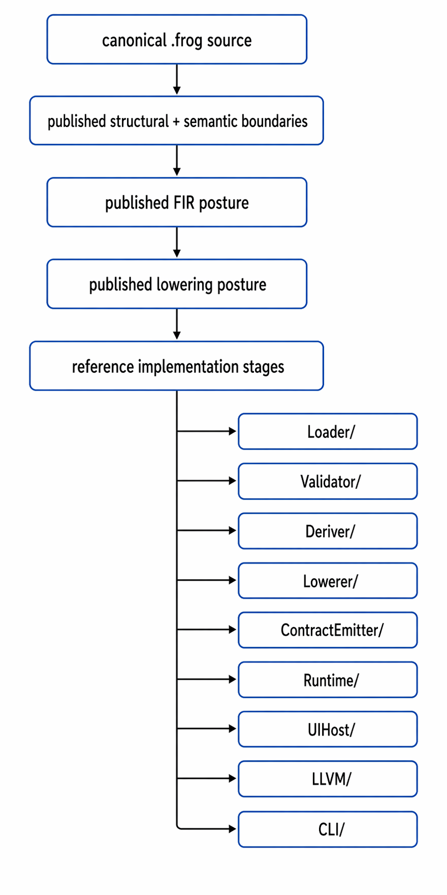
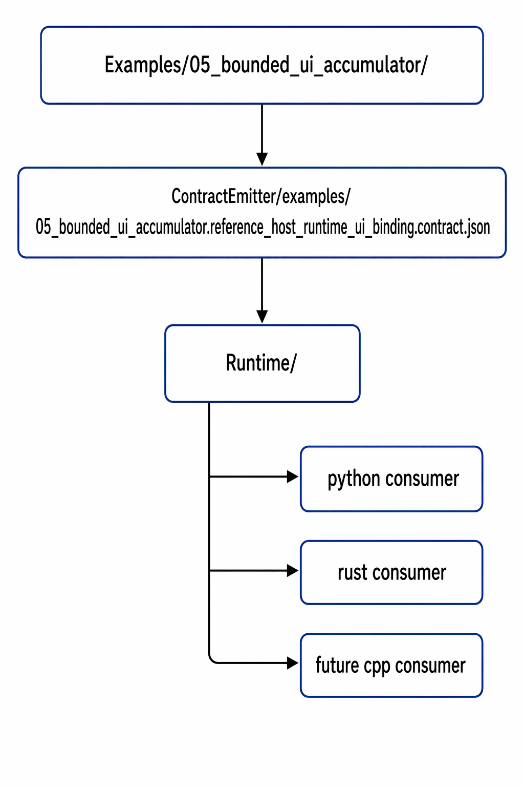

  

<h1 align="center">FROG Reference Implementation Workspace</h1>

  <strong>Non-normative executable workspace for inspecting and exercising the published FROG corridor from source to contract to runtime or compiler-family consumption</strong> 
  <em>FROG — Free Open Graphical Language</em>

<h2>Contents</h2>
<ul>
  <li><a href="#overview">1. Overview</a></li>
  <li><a href="#non-normative-status">2. Non-Normative Status</a></li>
  <li><a href="#why-this-directory-exists">3. Why This Directory Exists</a></li>
  <li><a href="#architectural-position">4. Architectural Position</a></li>
  <li><a href="#published-workspace-shape">5. Published Workspace Shape</a></li>
  <li><a href="#role-of-each-area">6. Role of Each Area</a></li>
  <li><a href="#first-bounded-executable-corridor">7. First Bounded Executable Corridor</a></li>
  <li><a href="#example-contract-runtime-reading">8. Example -> Contract -> Runtime Reading</a></li>
  <li><a href="#example-contract-compiler-reading">9. Example -> FIR -> Lowering -> Compiler Reading</a></li>
  <li><a href="#multi-runtime-posture">10. Multi-Runtime Posture</a></li>
  <li><a href="#what-this-workspace-owns">11. What This Workspace Owns</a></li>
  <li><a href="#what-this-workspace-does-not-own">12. What This Workspace Does Not Own</a></li>
  <li><a href="#stage-separation-discipline">13. Stage-Separation Discipline</a></li>
  <li><a href="#design-rules">14. Design Rules</a></li>
  <li><a href="#summary">15. Summary</a></li>
</ul>

<h2 id="overview">1. Overview</h2>

This directory contains the non-normative reference implementation workspace for FROG.
It exists to make selected repository-visible corridors executable and inspectable without turning implementation convenience into normative language law.

The workspace is intentionally stage-separated.
It is not a monolithic hidden compiler/runtime product.
It is a repository-visible execution workspace that consumes the published specification layers through explicit intermediate boundaries.

<h2 id="non-normative-status">2. Non-Normative Status</h2>

This workspace is <strong>non-normative</strong>.
It is not the definition of FROG.
It is not the owner of source law, semantic law, FIR law, lowering law, or backend-contract law.

Its role is to demonstrate that the published repository can already support bounded executable corridors through inspectable reference-family components.

<pre><code>published specification layers
   ->
define and bound meaning

reference implementation workspace
   ->
consume those layers without owning them
</code></pre>

<h2 id="why-this-directory-exists">3. Why This Directory Exists</h2>

A serious open language repository should be able to expose more than prose-only architecture.
It should also be able to show that at least one bounded slice can be carried through executable downstream stages without collapsing the language into one private implementation.

This workspace therefore exists to:

<ul>
  <li>load canonical source artifacts where relevant,</li>
  <li>exercise structural and semantic checks in reference form where relevant,</li>
  <li>derive or consume execution-facing representations in reference form,</li>
  <li>lower into backend-facing reference-family forms,</li>
  <li>emit consumer-facing backend contracts,</li>
  <li>execute selected bounded slices through explicit runtime consumers,</li>
  <li>and progressively support compiler-family paths where native closure is required.</li>
</ul>

<h2 id="architectural-position">4. Architectural Position</h2>

  

<pre><code>canonical .frog source
      |
      v
published structural + semantic boundaries
      |
      v
published FIR posture
      |
      v
published lowering posture
      |
      v
reference implementation stages
      |
      +-- Loader/
      +-- Validator/
      +-- Deriver/
      +-- Lowerer/
      +-- ContractEmitter/
      +-- Runtime/
      +-- UIHost/
      +-- LLVM/
      \-- CLI/
</code></pre>

The key rule is that this workspace follows the published corridor.
It does not silently replace it.

<h2 id="published-workspace-shape">5. Published Workspace Shape</h2>

<pre><code>Implementations/
└── Reference/
    ├── CLI/
    ├── ContractEmitter/
    ├── Deriver/
    ├── Loader/
    ├── Lowerer/
    ├── Runtime/
    ├── UIHost/
    ├── LLVM/
    ├── Validator/
    ├── Readme.md
    ├── common.py
    ├── example-artifact-requirements.md
    ├── frogc.md
    ├── internal-artifacts.md
    └── pipeline.md
</code></pre>

<h2 id="role-of-each-area">6. Role of Each Area</h2>

<ul>
  <li><code>CLI/</code> 
      Bounded command-line entry surfaces for inspection, conversion, validation, and execution exercises.</li>
  <li><code>Loader/</code> 
      Reference loading logic for canonical source or intermediate artifacts.</li>
  <li><code>Validator/</code> 
      Reference validation posture against the supported corridor subset.</li>
  <li><code>Deriver/</code> 
      Reference derivation work from accepted meaning toward execution-facing forms.</li>
  <li><code>Lowerer/</code> 
      Reference lowering work from execution-facing forms toward backend- or target-oriented forms.</li>
  <li><code>ContractEmitter/</code> 
      Materialization of backend-facing contract artifacts consumed by runtime families.</li>
  <li><code>Runtime/</code> 
      Runtime-family consumers of accepted backend contracts.</li>
  <li><code>UIHost/</code> 
      Host-facing UI realization experiments for examples that require rendered front panels.</li>
  <li><code>LLVM/</code> 
      Compiler-family posture for LLVM-oriented native executable paths.</li>
  <li><code>common.py</code> 
      Shared helper utilities used by multiple reference implementation stages.</li>
  <li><code>pipeline.md</code> 
      Reference pipeline overview and staged corridor explanation.</li>
  <li><code>frogc.md</code> 
      Compiler-facing command or tool posture for the reference workspace.</li>
  <li><code>example-artifact-requirements.md</code> 
      Expectations for which artifacts serious examples should expose.</li>
  <li><code>internal-artifacts.md</code> 
      Explanation of reference-workspace internal artifact families and their role.</li>
</ul>

<h2 id="first-bounded-executable-corridor">7. First Bounded Executable Corridor</h2>

The first repository-visible bounded executable corridor is centered on:

<pre><code>Examples/05_bounded_ui_accumulator/</code></pre>

That named example is the first small applicative vertical slice that visibly combines:

<ul>
  <li>front-panel participation,</li>
  <li>widget-value participation,</li>
  <li>minimal widget-reference participation,</li>
  <li>bounded structured control,</li>
  <li>explicit local state,</li>
  <li>public output publication,</li>
  <li>and a first published runtime-consumption posture.</li>
</ul>

<h2 id="example-contract-runtime-reading">8. Example -> Contract -> Runtime Reading</h2>

The corresponding repository-visible reference-family backend contract artifact is:

<pre><code>Implementations/Reference/ContractEmitter/examples/
└── 05_bounded_ui_accumulator.reference_host_runtime_ui_binding.contract.json</code></pre>

That contract is then consumed downstream by the reference runtime family under:

<pre><code>Implementations/Reference/Runtime/</code></pre>

This makes the first bounded executable corridor inspectable as:

  

<pre><code>Examples/05_bounded_ui_accumulator/
      |
      v
ContractEmitter/examples/
05_bounded_ui_accumulator.reference_host_runtime_ui_binding.contract.json
      |
      v
Runtime/
      |
      +-- python consumer
      +-- rust consumer
      \-- future cpp consumer
</code></pre>

<h2 id="example-contract-compiler-reading">9. Example -> FIR -> Lowering -> Compiler Reading</h2>

The long-term serious closure target for the same kind of slice also includes a compiler-family corridor:

<pre><code>canonical .frog source
      |
      v
validated meaning
      |
      v
FIR
      |
      v
lowering
      |
      v
compiler-facing form
      |
      v
LLVM-oriented native path
</code></pre>

This corridor is a downstream target family.
It must remain distinct from runtime-family contract consumption and distinct from the definition of FROG itself.

<h2 id="multi-runtime-posture">10. Multi-Runtime Posture</h2>

This workspace supports the intended rule that one runtime must not become the definition of FROG.

Within the reference family, multiple runtime language realizations may coexist, for example:

<ul>
  <li>a Python realization,</li>
  <li>a Rust realization,</li>
  <li>a C/C++ realization,</li>
  <li>and later other realizations if the published corridor justifies them.</li>
</ul>

Those runtimes should remain parallel consumers of the same emitted contract family for the same named slice.
They may differ in private structures or host mechanics, but they should stay aligned on declared contract obligations.

<h2 id="what-this-workspace-owns">11. What This Workspace Owns</h2>

<ul>
  <li>reference-family executable staging,</li>
  <li>reference-family loading, validation, derivation, lowering, and contract-emission mechanics where implemented,</li>
  <li>reference-family runtime consumption of accepted backend contracts,</li>
  <li>reference-family host/UI binding helpers where the bounded corridor requires them,</li>
  <li>reference-family compiler-family experiments where native closure is required,</li>
  <li>and repository-visible executable artifacts used to exercise selected named slices.</li>
</ul>

<h2 id="what-this-workspace-does-not-own">12. What This Workspace Does Not Own</h2>

<ul>
  <li>the canonical <code>.frog</code> source model,</li>
  <li>the normative structural-validation boundary,</li>
  <li>the normative semantic-acceptance boundary,</li>
  <li>the normative FIR boundary,</li>
  <li>the normative lowering boundary,</li>
  <li>the normative backend-contract boundary,</li>
  <li>the universal runtime architecture for all future implementations,</li>
  <li>or the universal UI toolkit/object model for all future hosts.</li>
</ul>

<pre><code>example source != emitted contract
emitted contract != runtime-private realization
reference runtime != universal FROG runtime
LLVM-oriented path != definition of FROG
</code></pre>

<h2 id="stage-separation-discipline">13. Stage-Separation Discipline</h2>

Each stage in this workspace should remain explicit about its ownership boundary.

<ul>
  <li><strong>Loader</strong> handles loading concerns.</li>
  <li><strong>Validator</strong> handles reference checking against the supported corridor.</li>
  <li><strong>Deriver</strong> handles execution-facing derivation work in reference form.</li>
  <li><strong>Lowerer</strong> handles backend-family-oriented or compiler-oriented specialization.</li>
  <li><strong>ContractEmitter</strong> materializes backend contract artifacts.</li>
  <li><strong>Runtime</strong> privately consumes accepted contract artifacts.</li>
  <li><strong>UIHost</strong> handles host-facing UI realization where applicable.</li>
  <li><strong>LLVM</strong> handles compiler-family posture for native closure.</li>
  <li><strong>CLI</strong> provides bounded entry surfaces for inspection and exercise.</li>
</ul>

<h2 id="design-rules">14. Design Rules</h2>

<ul>
  <li>Keep stage boundaries explicit.</li>
  <li>Do not hide undeclared assumptions across stages.</li>
  <li>Do not erase loop, state, or UI-participation meaning when the bounded corridor depends on them.</li>
  <li>Do not treat runtime-private convenience as normative specification truth.</li>
  <li>Keep emitted artifacts attributable to named example slices.</li>
  <li>Keep runtime-family and compiler-family consumers aligned with the published artifacts they claim to support.</li>
  <li>Prefer one complete bounded corridor over many disconnected implementation fragments.</li>
</ul>

<h2 id="summary">15. Summary</h2>

This directory is the non-normative executable workspace for the FROG reference family.
Its purpose is to exercise bounded published corridors through explicit reference stages without collapsing the language into one implementation.

The first repository-visible executable corridor is materially readable across:

<ul>
  <li><code>Examples/05_bounded_ui_accumulator/</code>,</li>
  <li><code>Implementations/Reference/ContractEmitter/examples/05_bounded_ui_accumulator.reference_host_runtime_ui_binding.contract.json</code>,</li>
  <li><code>Implementations/Reference/Runtime/</code>.</li>
</ul>

The next closure direction is to make the same example corridor explicit across Python, Rust, C/C++, peripheral UI realization, and LLVM-oriented native paths.

