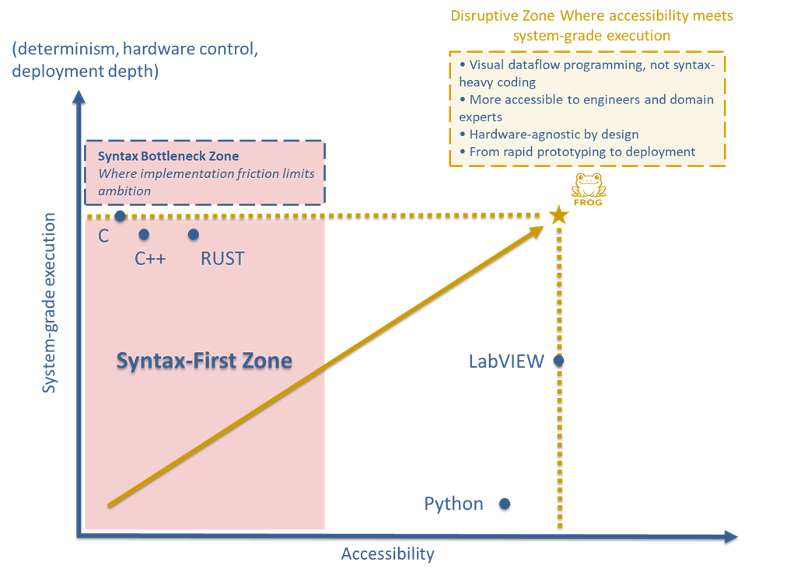

  

<h1 align="center">🐸 FROG — Free Open Graphical Language</h1>

  <strong>Free Open Graphical Dataflow Programming Language</strong> 
  FROG is an open, hardware-agnostic graphical dataflow programming language designed to describe computation as explicit executable graphs while remaining accessible, explicit, deterministic, inspectable, portable, and scalable across heterogeneous execution targets.

  Specification work initiated: <strong>8 March 2026</strong>

  <a href="#what-is-frog">What is FROG?</a> •
  <a href="#what-this-repository-defines">What this repository defines</a> •
  <a href="#positioning">Positioning</a> •
  <a href="#breaking-the-syntax-first-bottleneck">Breaking the syntax-first bottleneck</a> •
  <a href="#why-frog-exists">Why FROG exists</a> •
  <a href="#dataflow-programming">Dataflow programming</a> •
  <a href="#from-prototyping-to-critical-systems">From prototyping to critical systems</a> •
  <a href="#core-concept-diagram-front-panel-and-public-interface">Core concept</a> •
  <a href="#repository-structure">Repository structure</a> •
  <a href="#internal-documentation-map">Internal documentation map</a> •
  <a href="#recommended-reading-path">Recommended reading path</a> •
  <a href="#specification-architecture">Specification architecture</a> •
  <a href="#program-representation">Program representation</a> •
  <a href="#execution-architecture">Execution architecture</a> •
  <a href="#execution-observability-debugging-and-inspection">Execution observability, debugging, and inspection</a> •
  <a href="#execution-targets">Execution targets</a> •
  <a href="#open-industrial-hardware-standard">Open industrial hardware standard</a> •
  <a href="#security-and-optimization-by-design">Security &amp; optimization</a> •
  <a href="#interoperability">Interoperability</a> •
  <a href="#separation-of-language-and-tooling">Language separation</a> •
  <a href="#governance-and-ecosystem">Governance and ecosystem</a> •
  <a href="#project-status">Project status</a> •
  <a href="#license">License</a>

<h2 id="what-is-frog">What is FROG?</h2>

FROG is an open, hardware-agnostic <strong>graphical dataflow programming language</strong>.
It represents computation as explicit executable graphs rather than as syntax-first sequences of textual instructions.

Instead of describing a program primarily through ordered text, FROG describes a program through:

<ul>
  <li>typed nodes,</li>
  <li>typed ports,</li>
  <li>directed graph connections,</li>
  <li>structured control regions,</li>
  <li>explicit public interface boundaries,</li>
  <li>optional front-panel widgets and interaction layers.</li>
</ul>

Execution emerges from data availability, structural rules, explicit control structures, standardized primitive behavior, optional profile-owned capability behavior, and explicit local-memory semantics rather than from manually authored instruction order.

FROG is designed to remain independent from any specific IDE, compiler, runtime, operating system, or hardware vendor.
This separation provides a durable basis for multiple independent implementations and long-term industrial interoperability.

FROG is intended to scale from accessible graphical authoring to demanding execution contexts such as industrial automation, embedded systems, heterogeneous compute targets, and future conforming execution ecosystems.

<h2 id="what-this-repository-defines">What this repository defines</h2>

This repository defines the <strong>published FROG specification</strong>.
It is the repository where the language and its surrounding specification layers are written and stabilized.

Its role is to provide a durable open foundation for future:

<ul>
  <li>IDEs,</li>
  <li>validators,</li>
  <li>runtimes,</li>
  <li>compilers,</li>
  <li>execution backends,</li>
  <li>profile-supporting toolchains,</li>
  <li>ecosystem services and integrations.</li>
</ul>

This repository does <strong>not</strong> define one mandatory product implementation.
It does not equate the language with one IDE, one runtime, one vendor stack, or one deployment model.

Accordingly:

<ul>
  <li><strong>FROG is not an IDE.</strong></li>
  <li><strong>FROG is not a single runtime.</strong></li>
  <li><strong>FROG is not a vendor product.</strong></li>
  <li><strong>FROG is an open language specification with distinct source, semantic, library, profile, and IDE-facing specification layers.</strong></li>
</ul>

<h2 id="positioning">Positioning</h2>

FROG is designed to combine the accessibility of graphical programming with the execution depth required for deterministic, industrial, embedded, and high-performance systems.

Its ambition is not merely to make programming easier, and not merely to make execution more powerful.
Its ambition is to reduce the historical trade-off between:

<ul>
  <li>ease of expression,</li>
  <li>clarity of system design,</li>
  <li>deterministic execution,</li>
  <li>deployment scalability,</li>
  <li>hardware integration depth.</li>
</ul>

  

  <em>
    FROG aims to combine graphical accessibility, explicit dataflow, and system-grade execution in one open language model.
  </em>

<h2 id="breaking-the-syntax-first-bottleneck">Breaking the syntax-first bottleneck</h2>

A major barrier in many traditional programming environments is that useful system design often begins only after a long period of syntax learning, pattern memorization, and language-specific implementation habits.

This creates an inversion:
instead of starting from the system that should exist,
developers often start from the syntax they already know how to write.

That inversion limits experimentation and slows architectural thinking.
It encourages people to ask:

<strong>“What can I build with the implementation techniques I already master?”</strong>

rather than:

<strong>“What system should I build, and how should its behavior be expressed?”</strong>

FROG is designed to reduce that bottleneck by moving more of the developer’s effort toward:

<ul>
  <li>data movement,</li>
  <li>system structure,</li>
  <li>interfaces,</li>
  <li>control regions,</li>
  <li>state visibility,</li>
  <li>execution semantics.</li>
</ul>

The goal is not to eliminate engineering complexity.
The goal is to shift complexity toward the system itself instead of toward syntax-first representation.

<h2 id="why-frog-exists">Why FROG exists</h2>

Graphical dataflow programming has already demonstrated major advantages in many engineering domains:

<ul>
  <li>natural parallelism,</li>
  <li>clear orchestration of behavior,</li>
  <li>strong correspondence between software structure and system behavior,</li>
  <li>high productivity for engineers, scientists, and domain experts,</li>
  <li>strong suitability for instrumentation, control, and observable systems.</li>
</ul>

However, many historical graphical environments have been tightly coupled to proprietary ecosystems where language, tooling, runtime, and hardware support are inseparable.

That model limits portability, slows independent ecosystem growth, and prevents multiple actors from implementing the same language cleanly.

FROG exists to define an <strong>open language specification</strong> for graphical dataflow programming that remains separate from:

<ul>
  <li>any single IDE,</li>
  <li>any single runtime,</li>
  <li>any single compiler,</li>
  <li>any single hardware vendor.</li>
</ul>

This repository therefore defines the language standard and the surrounding specification layers needed to support future conforming implementations.
The objective is to make it possible for different actors to build compatible FROG tooling while targeting one shared open language definition.

<h2 id="dataflow-programming">Dataflow programming</h2>

FROG follows a true <strong>dataflow execution model</strong>.

In instruction-sequenced programming, execution is primarily described as ordered steps.
In dataflow programming, operations become executable when their required input data is available.

<pre>
Traditional execution

A → B → C → D

Dataflow execution

   A
  / \
 B   C
  \ /
   D
</pre>

Execution order therefore emerges from dependencies rather than from manually authored textual ordering.
This model enables:

<ul>
  <li>automatic parallelism where valid,</li>
  <li>clear dependency visibility,</li>
  <li>deterministic execution models where required,</li>
  <li>efficient mapping to heterogeneous hardware.</li>
</ul>

<h2 id="from-prototyping-to-critical-systems">From prototyping to critical systems</h2>

FROG is designed to support both rapid experimentation and demanding deployment.

The same programming model is intended to scale across domains such as:

<ul>
  <li>scientific computing,</li>
  <li>measurement and control,</li>
  <li>industrial automation,</li>
  <li>embedded systems,</li>
  <li>real-time control,</li>
  <li>microcontroller-oriented execution,</li>
  <li>accelerated and edge computing,</li>
  <li>high-performance systems.</li>
</ul>

Usability and execution depth are treated as complementary goals rather than mutually exclusive ones.

<h2 id="core-concept-diagram-front-panel-and-public-interface">Core concept: Diagram, Front Panel, and Public Interface</h2>

A FROG program combines multiple related but distinct source-level concepts.
The repository deliberately separates them so that execution meaning, public API, and UI-facing authoring remain coherent over time.

<h3>Diagram — the authoritative executable graph</h3>

The diagram defines the executable logic of the program.
It is the authoritative source-level execution graph.

It contains:

<ul>
  <li>primitive nodes,</li>
  <li>structure nodes,</li>
  <li>sub-FROG invocations,</li>
  <li>interface boundary nodes,</li>
  <li>widget-related graph nodes,</li>
  <li>directed graph edges,</li>
  <li>source-level annotations and documentation.</li>
</ul>

The diagram expresses:

<ul>
  <li>ordinary computation,</li>
  <li>control structures such as <code>case</code>, <code>for_loop</code>, and <code>while_loop</code>,</li>
  <li>public interface participation through <code>interface_input</code> and <code>interface_output</code>,</li>
  <li>front-panel value participation through <code>widget_value</code>,</li>
  <li>object-style widget interaction through <code>widget_reference</code> and <code>frog.ui.*</code> primitives,</li>
  <li>optional profile-owned capability usage where supported by the active implementation,</li>
  <li>explicit local memory and valid cycles.</li>
</ul>

<h3>Public interface — the reusable program boundary</h3>

The public interface defines the typed reusable boundary of a FROG.
It describes the inputs and outputs that matter when a FROG is invoked, embedded, reused, validated, documented, or integrated by other FROGs or tools.

The public interface is not owned by the front panel.
It is defined independently and participates in the diagram through <code>interface_input</code> and <code>interface_output</code>.

<h3>Front Panel — the interaction layer</h3>

The front panel defines the graphical interaction layer of the program.
It contains widget instances, layout information, composition, styling, and optional UI-library references.

The front panel is not the public API of the FROG and it is not the execution graph of the FROG.
It defines how users see and interact with the program.

A FROG MAY exist without a front panel.
When absent, the program remains a valid executable graphical artifact centered on its diagram and public interface.

Primary widget values participate naturally in execution through <code>widget_value</code> nodes in the diagram.
There is no separate canonical front-panel binding section for ordinary value flow.

<h3>Widget interaction model</h3>

FROG distinguishes two widget interaction paths:

<ul>
  <li><strong>natural value path</strong> — widget primary value participation through <code>widget_value</code>,</li>
  <li><strong>object-style path</strong> — explicit widget access through <code>widget_reference</code> together with <code>frog.ui.property_read</code>, <code>frog.ui.property_write</code>, and <code>frog.ui.method_invoke</code>.</li>
</ul>

These two paths are related but distinct.
This keeps ordinary dataflow wiring simple while preserving a clean long-term object model for UI interaction.

<h2 id="repository-structure">Repository structure</h2>

This repository is organized by <strong>architectural responsibility</strong>.
Each top-level directory has a specific role in the specification.

<pre><code>FROG/
│
├── Expression/                       Canonical source specification for .frog programs
├── Language/                         Normative execution semantics for validated programs
├── Libraries/                        Intrinsic standard primitive-library specifications
├── Profiles/                         Optional standardized capability-family specifications
├── IDE/                              IDE architecture, authoring, observability, debugging, and inspection
│
├── CLA.md                            Contributor license agreement requirements
├── CONTRIBUTING.md                   Contribution process and contribution rules
├── GOVERNANCE.md                     Governance, stewardship, and ecosystem model
├── FROG logo.svg                     Official logo asset
├── LICENSE                           Repository license
├── Readme.md                         Repository landing page and architectural overview
└── frog-orville-chart.png            Positioning illustration used by the repository</code></pre>

<h3><code>Expression/</code> — canonical source specification</h3>

This directory defines the canonical <code>.frog</code> source format.
It describes what a FROG source file contains, how source sections are represented, and how source-visible program objects are serialized.

<h3><code>Language/</code> — normative execution semantics</h3>

This directory defines cross-cutting execution semantics for validated FROG programs.
It is the normative home of language meaning when that meaning cannot be owned by one isolated source section or one intrinsic primitive-library document alone.

<h3><code>Libraries/</code> — intrinsic standard primitive libraries</h3>

This directory defines intrinsic library namespaces and primitive catalogs used by executable diagrams.
It is the normative home of standardized primitive identities, ports, primitive-local metadata, and primitive-local behavior that belong to the core language surface.

<h3><code>Profiles/</code> — optional standardized capability families</h3>

This directory defines optional standardized capability families that extend the usable surface of FROG without redefining the canonical source structure of the language core and without redefining core execution semantics.
It is the normative home of profile-owned primitive families and other optional capability contracts that should not be treated as intrinsic always-present language libraries.

This separation matters.
Capabilities that depend on external ecosystems, foreign runtimes, platform services, ABIs, databases, network stacks, or similar assumptions SHOULD be standardized through profiles or external ecosystem layers rather than absorbed by default into the intrinsic library core.

<h3><code>IDE/</code> — IDE architecture and editing model</h3>

This directory defines the architecture and responsibilities of a FROG development environment.
It explains how editing relates to the Program Model, serialized Expression, validation, execution preparation, execution observability, debugging, probes, watch views, snippets, and Express authoring.

<h2 id="internal-documentation-map">Internal documentation map</h2>

The repository contains multiple normative and architectural documents.
The map below summarizes the role of every Markdown document currently present in the repository.

<pre><code>FROG/
├── Readme.md
│   -> repository landing page and global architectural entry point
├── CONTRIBUTING.md
│   -> contribution workflow, expectations, and cross-document coherence rules
├── CLA.md
│   -> contributor license agreement entry point and legal contribution notice
├── GOVERNANCE.md
│   -> repository governance, stewardship model, open-specification posture,
│      ecosystem participation, and future conformance / trademark boundary
│
├── Expression/
│   ├── Readme.md
│   │   -> architectural entry point for canonical source representation
│   ├── Metadata.md
│   │   -> descriptive program metadata and non-executable identification fields
│   ├── Type.md
│   │   -> canonical type-expression model used across the source format
│   ├── Interface.md
│   │   -> public typed inputs and outputs of a FROG
│   ├── Connector.md
│   │   -> graphical perimeter mapping of interface ports when reused as a node
│   ├── Diagram.md
│   │   -> authoritative executable graph as canonical source representation
│   ├── Front panel.md
│   │   -> optional front-panel composition and user-facing interaction surface
│   ├── Widget.md
│   │   -> widget object model, widget classes, properties, methods, events, and roles
│   ├── Widget interaction.md
│   │   -> diagram-side widget interaction paths and execution-facing widget access model
│   ├── Control structures.md
│   │   -> source-facing representation of canonical control structures
│   ├── State and cycles.md
│   │   -> source-facing representation of explicit local memory and cycle formation rules
│   ├── Icon.md
│   │   -> reusable-node icon representation
│   ├── IDE preferences.md
│   │   -> optional IDE-facing source metadata with no executable authority
│   └── Cache.md
│       -> optional non-authoritative cache content for tooling convenience
│
├── Language/
│   ├── Readme.md
│   │   -> architectural entry point for normative execution semantics
│   ├── Control structures.md
│   │   -> normative execution meaning of case, for_loop, and while_loop
│   ├── State and cycles.md
│   │   -> normative meaning of explicit local memory and valid feedback cycles
│   ├── Execution model.md
│   │   -> language-level execution-model core: validated executable graph,
│   │      live execution instance, source identity, activation, execution context,
│   │      semantic milestones, and committed source-level state
│   └── Execution control and observation boundaries.md
│       -> safe observation points, pause-consistent snapshots, safe debug stops,
│          and minimal completion / fault / abort boundary semantics
│
├── Libraries/
│   ├── Readme.md
│   │   -> architectural entry point for intrinsic standard primitive families
│   ├── Core.md
│   │   -> foundational frog.core primitive library
│   ├── Math.md
│   │   -> frog.math numeric scalar operations beyond the minimal core
│   ├── Collections.md
│   │   -> frog.collections collection and array-oriented primitives
│   ├── Text.md
│   │   -> frog.text string and text-processing primitives
│   ├── IO.md
│   │   -> frog.io file, path, byte, and related I/O primitives
│   ├── Signal.md
│   │   -> frog.signal first-wave signal-processing primitives
│   ├── UI.md
│   │   -> frog.ui executable widget interaction primitives
│   └── Connectivity.md
│       -> transition note for frog.connectivity, redirecting normative ownership
│          to the Interop profile in Profiles/
│
├── Profiles/
│   ├── Readme.md
│   │   -> architectural entry point for optional standardized capability families
│   └── Interop.md
│       -> Interop profile specification for frog.connectivity.* and related
│          optional foreign-runtime / SQL interoperability capability
│
└── IDE/
    ├── Readme.md
    │   -> architectural entry point for the FROG IDE and Program Model
    ├── Palette.md
    │   -> palette model for surfacing primitives, structures, reusable nodes,
    │      and guided authoring entries
    ├── Express.md
    │   -> guided Express authoring model and normalization to canonical FROG content
    ├── Execution observability.md
    │   -> source-aligned live execution observability contract for IDE tooling
    ├── Debugging.md
    │   -> interactive debugging behavior built on source-aligned observability
    ├── Probes.md
    │   -> live local inspection probes for values and selected execution state
    ├── Watch.md
    │   -> persistent centralized watch-based inspection model
    ├── Snippet.md
    │   -> image-backed snippet capture, transport, paste, and reuse workflows
    └── FROG Snippet.md
        -> legacy redirect document pointing to Snippet.md
</code></pre>

This map is intentionally architectural rather than merely enumerative.
Its purpose is to make repository ownership boundaries and recommended reading paths easier to understand.

<h2 id="recommended-reading-path">Recommended reading path</h2>

Readers who are new to the repository should normally approach it in the following order:

<pre>
Readme.md
   |
   v
Expression/Readme.md
   |
   v
Language/Readme.md
   |
   v
Libraries/Readme.md
   |
   v
Profiles/Readme.md
   |
   v
IDE/Readme.md
</pre>

This order mirrors the current architectural baseline:

<ul>
  <li><strong>Expression</strong> defines the canonical saved source form,</li>
  <li><strong>Language</strong> defines cross-cutting execution meaning for validated programs,</li>
  <li><strong>Libraries</strong> define the intrinsic standardized executable primitive vocabularies,</li>
  <li><strong>Profiles</strong> define optional standardized capability families beyond the intrinsic core,</li>
  <li><strong>IDE</strong> defines authoring, observability, debugging, and inspection responsibilities built on top of those foundations.</li>
</ul>

<h2 id="specification-architecture">Specification architecture</h2>

The repository is intentionally split into distinct architectural layers:

<ul>
  <li><strong>Expression</strong> — canonical source representation, source sections, and source serialization rules,</li>
  <li><strong>Language</strong> — normative execution semantics for validated programs,</li>
  <li><strong>Libraries</strong> — intrinsic standardized primitive vocabularies and primitive-local behavior,</li>
  <li><strong>Profiles</strong> — optional standardized capability families and profile-owned capability contracts,</li>
  <li><strong>IDE</strong> — authoring architecture, editor-facing models, execution observability, debugging semantics, inspection workflows, snippets, and Express authoring.</li>
</ul>

This separation is deliberate.
It prevents the language from being reduced to one editor, one runtime, or one vendor implementation.

It also makes the repository suitable as the basis of an open standard:
different actors may later build compatible IDEs, validators, runtimes, compilers, toolchains, ecosystem services, and profile-supporting implementations while still targeting the same language definition.

At the current repository stage, this five-layer split is the main architectural baseline.
Additional execution-facing layers such as IR, lowering, compilation, deployment, runtime profiles, or conformance-oriented execution profiles MAY be structured more explicitly over time, but they are not yet a separate fully closed top-level specification family in the same sense as <code>Expression/</code>, <code>Language/</code>, <code>Libraries/</code>, <code>Profiles/</code>, and <code>IDE/</code>.

<h2 id="program-representation">Program representation</h2>

FROG programs should be understood across three distinct representation levels.

<h3>1. FROG Expression</h3>

The <strong>FROG Expression</strong> is the serialized source representation stored in a <code>.frog</code> file.
It is the canonical source form of a FROG program.

A FROG is represented by a structured, human-readable JSON source file with the <code>.frog</code> extension.
That canonical source file is transparent, editable, portable, and version-control-friendly.

A canonical <code>.frog</code> source file MUST contain:

<ul>
  <li><code>spec_version</code>,</li>
  <li><code>metadata</code>,</li>
  <li><code>interface</code>,</li>
  <li><code>diagram</code>.</li>
</ul>

It MAY additionally contain:

<ul>
  <li><code>front_panel</code>,</li>
  <li><code>connector</code>,</li>
  <li><code>icon</code>,</li>
  <li><code>ide</code>,</li>
  <li><code>cache</code>.</li>
</ul>

Optional sections MUST NOT redefine authoritative program semantics.
The diagram remains the authoritative source-level execution structure.
The front panel remains optional and non-authoritative for public interface definition.

<h3>2. FROG Program Model</h3>

The <strong>FROG Program Model</strong> is the canonical editable in-memory representation used by IDEs during authoring.
It is reconstructed from the FROG Expression and maintained while the user edits the program.

It maintains coherent relationships between:

<ul>
  <li>interface declarations and <code>interface_input</code> / <code>interface_output</code> nodes,</li>
  <li>front-panel widget declarations and <code>widget_value</code> / <code>widget_reference</code> nodes,</li>
  <li>structure nodes and their owned regions,</li>
  <li>semantic graph content and source-level layout information,</li>
  <li>authoring-facing insertion views and canonical source identities,</li>
  <li>Express presentation state and the canonical objects that an Express entry edits or materializes.</li>
</ul>

This Program Model is an IDE architectural concept.
It is not the same thing as the raw serialized source file.
It is also not, by itself, the normative execution-semantics layer of the language.

<h3>3. Execution-oriented representation</h3>

A validated FROG is not executed directly from raw source text.
A conforming toolchain is expected to validate the source-derived program representation and then derive an execution-oriented form suitable for execution, analysis, optimization, lowering, or compilation.

That execution-oriented level is an important part of the long-term architecture, but it is not yet a fully closed standalone top-level specification layer in the current repository.
At the present stage, the repository defines the conceptual need for that layer and part of the language-level semantic foundations on which such a layer depends.

Accordingly, the current repository already stabilizes:

<ul>
  <li>the canonical source form,</li>
  <li>the editable Program Model as an IDE architectural concern,</li>
  <li>language-level execution semantics needed to interpret validated programs,</li>
  <li>intrinsic primitive vocabularies,</li>
  <li>optional profile-owned capability families,</li>
  <li>IDE-facing observability and debugging layers built on top of those semantics.</li>
</ul>

<h2 id="execution-architecture">Execution architecture</h2>

A conforming ecosystem may conceptually follow an architecture similar to the one below:

<pre>
                 FROG IDE
        +---------------------------+
        | Diagram + Front Panel UI  |
        +-------------+-------------+
                      |
                      v
             FROG Program Model
         (editable in-memory model)
              /               \
             /                 \
            v                   v
🟩 OPEN SOURCE LAYER       ⚙️ Validation / Execution
🟩 FROG Expression            preparation pipeline
(.frog source,                        |
 human-readable,                      v
 open JSON)              🟩 OPEN EXECUTION LAYER
                         🟩 Open execution IR / validated IR
                          (derived, readable, inspectable,
                           open specification-facing layer)
                                   |
                                   v
                      Compiler(s) / Backend(s) / Runtime(s)
                                   |
                                   v
                            ▶️ Target execution
                                   |
                  +----------------+----------------+
                  |                                 |
                  v                                 v
       Execution observability             Runtime activity
      (source-aligned live view)          on the active target
                  |
                  v
               Debugging
      (pause / resume / break / step)
                  |
        +---------+---------+
        |                   |
        v                   v
      Probes              Watch
 (local inspection)   (persistent inspection)
</pre>

During development, tools maintain the Program Model.
Saving serializes that model into canonical source.
Execution requests validate the relevant program content and derive an execution-oriented form that is then consumed by execution-facing systems.

This architecture enforces a clean separation between:

<ul>
  <li>authoring,</li>
  <li>source serialization,</li>
  <li>editable in-memory representation,</li>
  <li>execution preparation,</li>
  <li>execution-oriented derivation,</li>
  <li>live execution observability,</li>
  <li>interactive debugging control,</li>
  <li>live inspection through probes,</li>
  <li>persistent inspection through watch views,</li>
  <li>compilation and backend processing,</li>
  <li>runtime execution.</li>
</ul>

The current repository defines this architecture unevenly by design:
some layers are already documented in detail,
while others remain architectural direction awaiting more explicit future specification work.

<h2 id="execution-observability-debugging-and-inspection">Execution observability, debugging, and inspection</h2>

Interactive inspection and debugging are not performed directly on raw serialized source.
They are performed on a live execution derived from validated program content and projected back onto source-meaningful objects.

<strong>Execution observability</strong> is the source-aligned live view that allows runtime activity to be mapped back to concepts such as:

<ul>
  <li>node activations,</li>
  <li>edge-level value availability,</li>
  <li>structure entry and region selection,</li>
  <li>loop iteration progression,</li>
  <li>local-memory state activity,</li>
  <li>pause-consistent execution snapshots.</li>
</ul>

<strong>Debugging</strong> is the interactive control layer built on top of that observability.
It allows an IDE to inspect and guide execution through source-level concepts such as:

<ul>
  <li>execution highlighting,</li>
  <li>manual pause and resume,</li>
  <li>breakpoints,</li>
  <li>single-step controls,</li>
  <li>fault-directed source localization.</li>
</ul>

<strong>Probes</strong> are source-aligned live inspection tools built on top of execution observability and used together with debugging.
They allow an IDE to inspect values or selected execution state associated with objects such as:

<ul>
  <li>edges,</li>
  <li>node ports,</li>
  <li>local-memory state,</li>
  <li>selected UI-related execution objects in stricter profiles.</li>
</ul>

<strong>Watch</strong> provides persistent centralized inspection of selected source-visible targets during or after live execution.
Unlike probes, which are primarily local inspection objects, watches are intended to remain visible in a managed watch list or equivalent watch view.

In FROG, debugging and inspection are dataflow-first rather than line-oriented.
They operate on observable graph activity, structures, sub-FROG scopes, value flow, local memory, and explicit UI-related execution objects rather than on a fictional sequential instruction list.

<h2 id="execution-targets">Execution targets</h2>

FROG programs are designed to remain source-level stable across multiple hardware classes.
The language is not tied to one processor family, one operating system, one runtime architecture, or one vendor.

Representative target classes include:

<ul>
  <li><strong>General-purpose CPUs</strong> — workstation, server, and industrial PC execution,</li>
  <li><strong>Real-time targets</strong> — deterministic measurement and control systems,</li>
  <li><strong>Embedded systems</strong> — ARM and edge-oriented devices,</li>
  <li><strong>GPUs</strong> — accelerated compute targets,</li>
  <li><strong>FPGAs</strong> — programmable-logic targets,</li>
  <li><strong>Microcontrollers</strong> — constrained embedded execution,</li>
  <li><strong>Industrial edge controllers</strong> — integrated vendor-specific control and acquisition platforms.</li>
</ul>

The programming model is intended to remain conceptually stable across such targets.
What changes is the active execution profile, the validation or lowering strategy, the backend, and the available platform services.

More explicit target-profile standardization MAY be refined over time.
At the current repository stage, target diversity is an architectural direction rather than a fully closed standalone profile taxonomy.

<h2 id="open-industrial-hardware-standard">Open industrial hardware standard</h2>

FROG aims to be more than a language that merely supports multiple targets.
Its long-term goal is to provide an <strong>open industrial graphical programming standard</strong> that hardware and software ecosystems can build on without requiring a proprietary language boundary.

That means hardware vendors, runtime builders, industrial software platforms, embedded-system providers, and specialized toolchain developers should be able to support the same core language while preserving their own:

<ul>
  <li>runtime strategies,</li>
  <li>deployment models,</li>
  <li>validation constraints,</li>
  <li>hardware services,</li>
  <li>library stacks,</li>
  <li>target-specific optimization layers.</li>
</ul>

In practice, this may include:

<ul>
  <li>FROG-compatible runtimes,</li>
  <li>target-specific compilers and backends,</li>
  <li>driver-backed hardware libraries exposed as FROG nodes,</li>
  <li>deployment environments built around FROG execution,</li>
  <li>vendor-specific profiles or conformance targets.</li>
</ul>

<h2 id="security-and-optimization-by-design">Security and optimization by design</h2>

FROG integrates validation and optimization into its architecture.

Base principles include:

<ul>
  <li>strict type validation,</li>
  <li>graph validation before execution,</li>
  <li>controlled execution and observation boundaries,</li>
  <li>explicit structure semantics,</li>
  <li>explicit local-memory semantics for valid feedback loops,</li>
  <li>deterministic execution guarantees where supported by the active profile.</li>
</ul>

Optimization occurs primarily in execution-facing preparation, lowering, compilation, and backend stages:

<ul>
  <li>graph simplification,</li>
  <li>dead-node elimination,</li>
  <li>constant folding,</li>
  <li>memory optimization,</li>
  <li>parallel scheduling where valid,</li>
  <li>target-specific lowering,</li>
  <li>profile-aware specialization.</li>
</ul>

<h2 id="interoperability">Interoperability</h2>

FROG is designed for interoperability at several levels:

<ul>
  <li><strong>source interoperability</strong> — the canonical <code>.frog</code> file is readable, structured, and tool-independent,</li>
  <li><strong>editing interoperability</strong> — multiple IDEs may reconstruct equivalent Program Models,</li>
  <li><strong>semantic interoperability</strong> — validated programs are interpreted against shared language, intrinsic-library, and profile specifications,</li>
  <li><strong>execution interoperability</strong> — multiple toolchains may derive compatible execution-facing representations and target artifacts,</li>
  <li><strong>ecosystem interoperability</strong> — the language remains separate from vendor lock-in.</li>
</ul>

FROG is also designed to integrate with external languages and platform APIs through stable interoperation mechanisms.
In the current repository architecture, such environment-dependent capability families SHOULD be standardized through optional profiles rather than treated automatically as intrinsic standard libraries.

Representative integration targets may include:

<ul>
  <li>C / C++,</li>
  <li>Rust,</li>
  <li>Python,</li>
  <li>.NET,</li>
  <li>other ABI-compatible environments.</li>
</ul>

External functions and platform services can be exposed as FROG nodes while preserving graph-level validation and explicit type behavior.
This is also essential for hardware support, because drivers, SDKs, real-time services, FPGA toolflows, embedded platform stacks, and external software ecosystems can be integrated without collapsing the language into one closed ecosystem.

<h2 id="separation-of-language-and-tooling">Language separation</h2>

FROG explicitly separates:

<ul>
  <li>the language specification,</li>
  <li>the canonical source representation,</li>
  <li>the editable program model,</li>
  <li>intrinsic primitive vocabularies,</li>
  <li>optional standardized capability profiles,</li>
  <li>execution-oriented derivation,</li>
  <li>execution observability,</li>
  <li>interactive debugging semantics,</li>
  <li>live inspection through probes,</li>
  <li>persistent watch-based inspection,</li>
  <li>snippet-based authoring transport,</li>
  <li>compiler implementations,</li>
  <li>backend implementations,</li>
  <li>runtime implementations,</li>
  <li>development environments,</li>
  <li>hardware adaptation layers,</li>
  <li>deployment and orchestration layers.</li>
</ul>

At the modeling level, FROG also separates:

<ul>
  <li>language from IDE,</li>
  <li>intrinsic libraries from optional profiles,</li>
  <li>IDE from runtime,</li>
  <li>runtime from hardware,</li>
  <li>public interface from front panel,</li>
  <li>diagram from connector,</li>
  <li>natural widget value flow from object-style widget interaction.</li>
</ul>

This enables:

<ul>
  <li>multiple IDE implementations,</li>
  <li>multiple validators,</li>
  <li>multiple compilers,</li>
  <li>multiple backends,</li>
  <li>multiple runtimes,</li>
  <li>multiple profile-supporting ecosystems around the same core language,</li>
  <li>independent ecosystem evolution around a shared graphical standard.</li>
</ul>

The specification defines the language, not one product.

<h2 id="governance-and-ecosystem">Governance and ecosystem</h2>

FROG is governed as an <strong>open specification</strong>.
The repository is intended to remain readable, implementable, and usable by independent parties while preserving long-term architectural coherence.

The current governance model is steward-led.
Graiphic is the initial steward of the FROG specification repository and is responsible for maintaining architectural coherence, reviewing proposed changes, and publishing authoritative repository revisions.

Open specification does not imply a single implementation model.
Different actors may build open-source or proprietary IDEs, validators, runtimes, compilers, libraries, profiles, integrations, deployment systems, and related services around the FROG specification.

Openness of the specification does not automatically grant trademark rights or official compatibility claims.
Names, logos, certification marks, and claims such as <em>official</em>, <em>certified</em>, <em>endorsed</em>, or <em>FROG-certified</em> MAY be governed by separate conformance, certification, and branding policies.

Over time, the governance model is intended to distinguish clearly between:

<ul>
  <li>implementing core FROG,</li>
  <li>implementing core FROG plus explicitly named profiles,</li>
  <li>claiming a conformant implementation under an applicable conformance policy,</li>
  <li>claiming certified or official compatibility status under an applicable certification or branding policy.</li>
</ul>

The intended ecosystem direction is that the specification remains open, while official certification, official branding, and equivalent steward-controlled compatibility claims MAY be governed separately.
Commercial implementations seeking official certification or branding MAY be subject to paid verification or licensing policies, while non-commercial implementations MAY be verified free of charge or at minimal cost under applicable steward policies.

<h2 id="project-status">Project status</h2>

FROG is currently under active design, cleanup, and stabilization.
The repository already contains substantial material across canonical source representation, language semantics, intrinsic standard primitive libraries, optional profile architecture, and IDE architecture, but the overall specification is still converging toward a coherent v0.1 foundation.

Current repository direction includes:

<ul>
  <li>stabilizing the canonical source specification,</li>
  <li>stabilizing the separation between canonical source representation and normative execution semantics,</li>
  <li>clarifying language semantics and execution behavior,</li>
  <li>stabilizing the intrinsic library boundary,</li>
  <li>establishing optional profile families without collapsing them into the intrinsic core,</li>
  <li>defining IDE responsibilities without coupling the language to one implementation,</li>
  <li>defining source-aligned execution observability for live execution,</li>
  <li>defining dataflow-native debugging semantics for FROG IDEs,</li>
  <li>defining source-aligned live inspection through probes,</li>
  <li>defining persistent centralized watch-based inspection for FROG IDEs,</li>
  <li>defining image-backed snippet-based reusable authoring transport,</li>
  <li>defining guided Express authoring as an IDE convenience layer that normalizes to canonical FROG content.</li>
</ul>

At the same time, some broader execution-facing layers remain architectural direction rather than fully closed repository families.
Topics such as more explicit IR structuring, lowering, compilation, deployment profiles, runtime-facing specification layers, and conformance-oriented execution profiles MAY be refined further over time.

The long-term ambition is to establish a durable open graphical programming ecosystem that can scale from experimentation to deeply integrated industrial deployment.

Discussions, feedback, and contributions are welcome.

<h2 id="license">License</h2>

This project is licensed under the <strong>Apache License 2.0</strong>.
See <code>LICENSE</code> for details.

External contributions are governed through the repository contribution process and Contributor License Agreement requirements.
See <code>CONTRIBUTING.md</code> and <code>CLA.md</code>.

Repository stewardship, governance direction, and ecosystem positioning are described in <code>GOVERNANCE.md</code>.

  

  <strong>FROG — Free Open Graphical Language</strong> 
  Open graphical dataflow programming, specified as a language rather than owned as a product.

