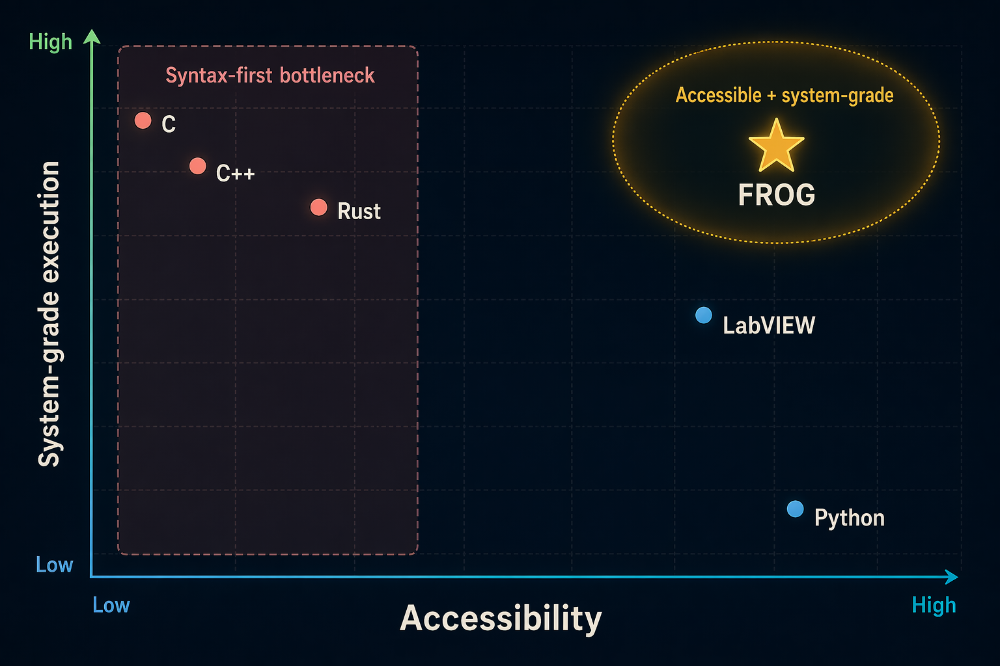
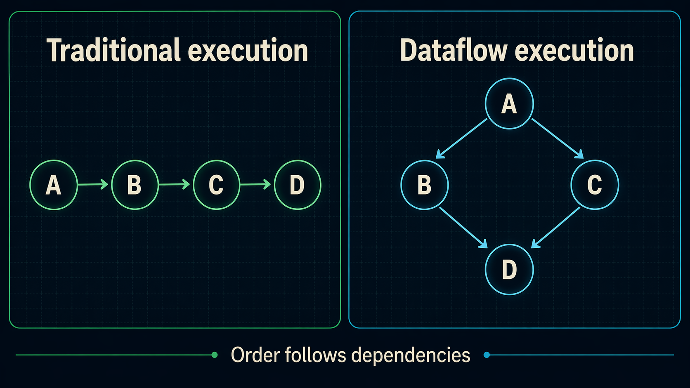
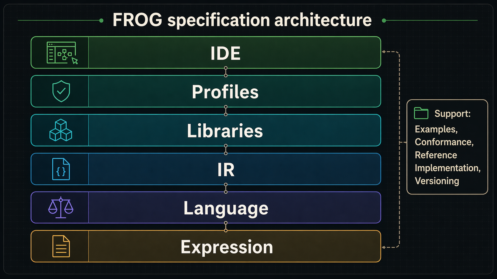
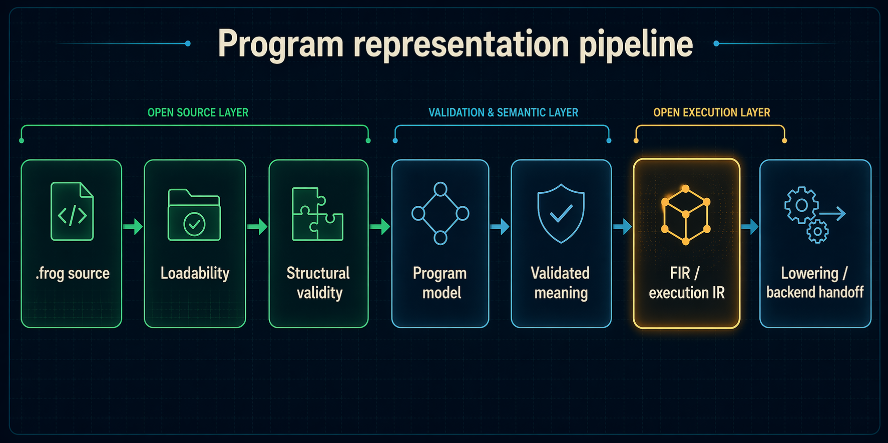
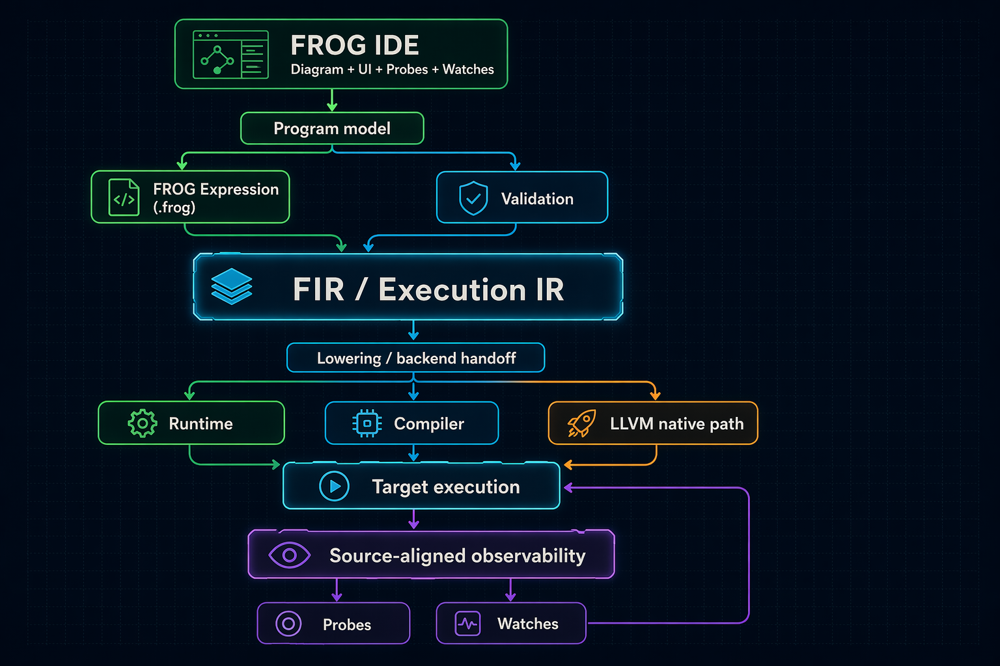

  

  

<h1 align="center">🐸 FROG — Free Open Graphical Language</h1>

  <strong>Free Open Graphical Dataflow Programming Language</strong> 
  FROG is an open, hardware-agnostic graphical dataflow programming language designed to describe computation as explicit executable graphs while remaining accessible, explicit, inspectable, portable, auditable, and scalable across heterogeneous execution targets.

  Specification work initiated: <strong>8 March 2026</strong>

  <a href="#what-is-frog">What is FROG?</a> •
  <a href="#what-this-repository-defines">What this repository defines</a> •
  <a href="#published-repository-state">Published repository state</a> •
  <a href="#campaign-priority">Campaign priority</a> •
  <a href="#positioning">Positioning</a> •
  <a href="#breaking-the-syntax-first-bottleneck">Breaking the syntax-first bottleneck</a> •
  <a href="#why-frog-exists">Why FROG exists</a> •
  <a href="#frog-in-the-ai-era">FROG in the AI era</a> •
  <a href="#dataflow-programming">Dataflow programming</a> •
  <a href="#from-prototyping-to-critical-systems">From prototyping to critical systems</a> •
  <a href="#core-concept-diagram-front-panel-and-public-interface">Core concept</a> •
  <a href="#repository-structure">Repository structure</a> •
  <a href="#repository-runtime-and-native-execution-direction">Runtime and native execution direction</a> •
  <a href="#internal-documentation-map">Internal documentation map</a> •
  <a href="#recommended-reading-path">Recommended reading path</a> •
  <a href="#specification-architecture">Specification architecture</a> •
  <a href="#program-representation">Program representation</a> •
  <a href="#execution-architecture">Execution architecture</a> •
  <a href="#execution-observability-debugging-and-inspection">Execution observability, debugging, and inspection</a> •
  <a href="#execution-targets">Execution targets</a> •
  <a href="#open-industrial-hardware-standard">Open industrial hardware standard</a> •
  <a href="#security-and-optimization-by-design">Security &amp; optimization</a> •
  <a href="#interoperability">Interoperability</a> •
  <a href="#separation-of-language-and-tooling">Language separation</a> •
  <a href="#governance-and-ecosystem">Governance and ecosystem</a> •
  <a href="#project-status">Project status</a> •
  <a href="#license">License</a>

<h2 id="what-is-frog">What is FROG?</h2>

FROG is an open, hardware-agnostic <strong>graphical dataflow programming language</strong>.
It represents computation as explicit executable graphs rather than as syntax-first sequences of textual instructions.

Instead of describing a program primarily through ordered text, FROG describes a program through:

<ul>
  <li>typed nodes,</li>
  <li>typed ports,</li>
  <li>directed graph connections,</li>
  <li>structured control regions,</li>
  <li>explicit public interface boundaries,</li>
  <li>optional front-panel widgets and interaction layers,</li>
  <li>explicit observability surfaces such as probes, watches, and inspection-aware source objects.</li>
</ul>

Execution emerges from data availability, dependency structure, explicit control constructs, intrinsic standardized primitive behavior, optional profile-owned capability behavior, and explicit local-memory semantics rather than from manually authored instruction order.

FROG is designed to remain independent from any specific IDE, compiler, runtime, operating system, or hardware vendor.
That separation provides a durable basis for multiple independent implementations, long-term industrial interoperability, and auditable portability across toolchains.

FROG is intended to scale from accessible graphical authoring to demanding execution contexts such as industrial automation, embedded systems, heterogeneous compute targets, and future conforming execution ecosystems.

<h2 id="what-this-repository-defines">What this repository defines</h2>

This repository defines the <strong>published FROG specification</strong>.
It is the repository where the language and its surrounding specification layers are written, clarified, stabilized, and progressively closed.

Its role is to provide a durable open foundation for future:

<ul>
  <li>IDEs,</li>
  <li>validators,</li>
  <li>runtimes,</li>
  <li>compilers,</li>
  <li>execution backends,</li>
  <li>profile-supporting toolchains,</li>
  <li>ecosystem services and integrations.</li>
</ul>

The repository also contains repository-level support material that helps make the specification inspectable in practice:
named examples,
conformance material,
a non-normative reference implementation workspace,
a strategic framing layer,
a non-normative roadmap layer,
and a centralized specification-versioning surface.
Those areas support the published specification, but they do not replace its ownership boundaries.

This repository does <strong>not</strong> define one mandatory product implementation.
It does not equate the language with one IDE, one runtime, one compiler, one vendor stack, or one deployment model.

<ul>
  <li><strong>FROG is not an IDE.</strong></li>
  <li><strong>FROG is not a single runtime.</strong></li>
  <li><strong>FROG is not a single compiler.</strong></li>
  <li><strong>FROG is not a vendor product.</strong></li>
  <li><strong>FROG is an open language specification with distinct source, semantic, FIR, library, profile, IDE-facing, conformance, and version-governance layers.</strong></li>
</ul>

<h2 id="published-repository-state">Published repository state</h2>

At the current published state, the repository already contains the six core architectural specification families:
<code>Expression/</code>,
<code>Language/</code>,
<code>IR/</code>,
<code>Libraries/</code>,
<code>Profiles/</code>,
and <code>IDE/</code>.
These remain the primary ownership layers of the published language specification.

The repository also contains repository-level support areas and repository-level framing / governance layers:

<ul>
  <li><strong><code>Examples/</code></strong> — illustrative named source slices, applicative vertical-slice anchors, and bounded compiler-corridor mirrors,</li>
  <li><strong><code>Conformance/</code></strong> — public accept / reject / preserve expectations for the published repository state,</li>
  <li><strong><code>Implementations/Reference/</code></strong> — a non-normative reference implementation workspace used to exercise disciplined execution paths,</li>
  <li><strong><code>Versioning/</code></strong> — centralized specification-governance and current-status reporting for the published specification corpus,</li>
  <li><strong><code>Strategy/</code></strong> — a non-normative strategic framing layer distinct from normative ownership,</li>
  <li><strong><code>Roadmap/</code></strong> — a non-normative closure-sequencing layer distinct from both strategy and specification.</li>
</ul>

The published example surface already contains both:

<ul>
  <li>a numbered example-slice progression under <code>Examples/01_*</code> through <code>Examples/05_*</code>,</li>
  <li>and a narrower conservative compiler-corridor mirror under <code>Examples/compiler/</code>.</li>
</ul>

The first repository-visible applicative vertical-slice anchor is:

<pre><code>Examples/05_bounded_ui_accumulator/</code></pre>

That slice is currently the primary named source-to-runtime-to-native anchor because it visibly combines:

<ul>
  <li>front-panel participation,</li>
  <li>widget-value participation,</li>
  <li>minimal widget-reference participation,</li>
  <li>bounded structured control,</li>
  <li>explicit local state,</li>
  <li>public output publication,</li>
  <li>a published backend contract artifact,</li>
  <li>published downstream reference runtime consumers,</li>
  <li>and a first LLVM-oriented native proof corridor.</li>
</ul>

The current published runtime and native surface already includes:

<ul>
  <li>a repository-visible runtime directory under <code>Implementations/Reference/Runtime/</code>,</li>
  <li>a Python execution entry point for the published bounded slice,</li>
  <li>a Rust runtime-side consumer posture under <code>Implementations/Reference/Runtime/rust/</code>,</li>
  <li>a C/C++ runtime-side consumer posture under <code>Implementations/Reference/Runtime/cpp/</code>,</li>
  <li>and a first LLVM-oriented downstream dossier under <code>Implementations/Reference/LLVM/</code>.</li>
</ul>

At the same time, the repository does <strong>not</strong> claim full generalized symmetry across all future examples, all runtime families, or full rendered-native front-panel closure.
The correct current statement is narrower:
the repository now materially exposes a <strong>repository-visible bounded symmetry</strong> for the canonical Example 05 corridor across Python, Rust, C/C++, and a first LLVM-oriented native proof path.

That distinction matters.
The published direction already supports language/runtime/compiler separation, and the repository-visible executable closure is now materially stronger than before, while still remaining example-scoped and intentionally non-generalized.

<h2 id="campaign-priority">Campaign priority</h2>

The current campaign priority is explicit:
<strong>close serious published examples all the way to real execution and make multi-runtime modularity repository-visible.</strong>

A serious example is no longer considered finished merely because it is source-readable or architecturally plausible.
A serious example should progressively converge toward:

<ul>
  <li>one canonical <code>.frog</code> source,</li>
  <li>one explicit front-panel posture,</li>
  <li>one explicit peripheral UI object realization file when applicable,</li>
  <li>one explicit FIR reading,</li>
  <li>one explicit lowering posture,</li>
  <li>one backend contract,</li>
  <li>one Python mini runtime path,</li>
  <li>one Rust mini runtime path,</li>
  <li>one C/C++ mini runtime path,</li>
  <li>and, where applicable, one LLVM-oriented native executable path.</li>
</ul>

The canonical repository anchor for that campaign is currently:

<pre><code>Examples/05_bounded_ui_accumulator/</code></pre>

That slice should be read as the first repository-visible proof that the same named example can be carried through:

<ul>
  <li>source,</li>
  <li>front-panel package,</li>
  <li>FIR,</li>
  <li>lowering,</li>
  <li>runtime-family consumption,</li>
  <li>and a first native compiler-family corridor.</li>
</ul>

This campaign does <strong>not</strong> make one runtime the definition of FROG.
It makes the opposite point:
the language remains stable while downstream consumers remain modular.

<h2 id="positioning">Positioning</h2>

FROG is designed to combine the accessibility of graphical programming with the execution depth required for deterministic, industrial, embedded, high-performance, and safety-relevant systems.

Its ambition is to reduce the historical trade-off between:

<ul>
  <li>ease of expression,</li>
  <li>clarity of system design,</li>
  <li>deterministic execution,</li>
  <li>deployment scalability,</li>
  <li>hardware integration depth,</li>
  <li>human auditability of program structure.</li>
</ul>

  

  <em>
    FROG aims to combine graphical accessibility, explicit dataflow, auditability, and system-grade execution in one open language model.
  </em>

<h2 id="breaking-the-syntax-first-bottleneck">Breaking the syntax-first bottleneck</h2>

A major barrier in many traditional programming environments is that useful system design often begins only after a long period of syntax learning, pattern memorization, and language-specific implementation habits.

This creates an inversion:
instead of starting from the system that should exist,
developers often start from the syntax they already know how to write.

That inversion limits experimentation and slows architectural thinking.
It encourages people to ask:

<strong>“What can I build with the implementation techniques I already master?”</strong>

rather than:

<strong>“What system should I build, and how should its behavior be expressed?”</strong>

FROG is designed to reduce that bottleneck by moving more of the developer’s effort toward:

<ul>
  <li>data movement,</li>
  <li>system structure,</li>
  <li>interfaces,</li>
  <li>control regions,</li>
  <li>state visibility,</li>
  <li>execution semantics.</li>
</ul>

The goal is not to eliminate engineering complexity.
The goal is to shift complexity toward the system itself rather than toward syntax-first representation.

<h2 id="why-frog-exists">Why FROG exists</h2>

Graphical dataflow programming has already demonstrated major advantages in many engineering domains:

<ul>
  <li>natural parallelism,</li>
  <li>clear orchestration of behavior,</li>
  <li>strong correspondence between software structure and system behavior,</li>
  <li>high productivity for engineers, scientists, and domain experts,</li>
  <li>strong suitability for instrumentation, control, and observable systems.</li>
</ul>

However, many historical graphical environments have been tightly coupled to proprietary ecosystems where language, tooling, runtime, and hardware support are inseparable.

That model limits portability, slows independent ecosystem growth, prevents multiple actors from implementing the same language cleanly, and often leaves the saved program format and execution-facing layers too opaque for durable multi-vendor reuse.

FROG exists to define an <strong>open language specification</strong> for graphical dataflow programming that remains separate from:

<ul>
  <li>any single IDE,</li>
  <li>any single runtime,</li>
  <li>any single compiler,</li>
  <li>any single hardware vendor.</li>
</ul>

This repository therefore defines the language standard and the surrounding specification layers needed to support future conforming implementations.
The objective is to make it possible for different actors to build compatible FROG tooling while targeting one shared open language definition.

<h2 id="frog-in-the-ai-era">FROG in the AI era</h2>

FROG is not only relevant as an open graphical language.
It is also relevant as an <strong>AI-era auditability architecture</strong>.

A modern programming ecosystem increasingly needs representations that are:

<ul>
  <li>easy for tools to generate and transform,</li>
  <li>easy for humans to inspect and review,</li>
  <li>explicit enough to preserve structure across validation and derivation stages,</li>
  <li>open enough to avoid sovereignty loss through opaque vendor-controlled representations.</li>
</ul>

FROG addresses that need through three complementary properties:

<h3>Canonical JSON source</h3>

The canonical <code>.frog</code> source format is structured, machine-friendly, human-readable JSON.
That makes it naturally compatible with tooling pipelines, validation workflows, version control, deterministic serialization, and AI-assisted generation or transformation.

<h3>Graphically reviewable program structure</h3>

FROG keeps the executable structure explicit at the language level.
The program is not primarily hidden behind text parsing, coding idioms, or reconstruction tooling.
A reviewer can inspect nodes, ports, graph connections, structures, state boundaries, interface boundaries, widget interaction paths, probes, watch surfaces, and other source-meaningful execution objects directly as program objects.

<h3>Inspectable execution-facing IR</h3>

FROG does not stop at an open source file.
The execution-facing IR layer also remains open, inspectable, attributable, and recoverable.
This reduces the gap between:

<ul>
  <li>what was authored or generated,</li>
  <li>what was validated as program meaning,</li>
  <li>what was derived for execution-facing preparation,</li>
  <li>what is later lowered toward backend consumption.</li>
</ul>

<h2 id="dataflow-programming">Dataflow programming</h2>

FROG follows a true <strong>dataflow execution model</strong>.

In instruction-sequenced programming, execution is primarily described as ordered steps.
In dataflow programming, operations become executable when their required input data is available.

  

  <em>
    In dataflow execution, order follows graph dependencies rather than a manually authored instruction sequence.
  </em>

Execution order therefore emerges from dependencies rather than from manually authored textual ordering.
This model enables:

<ul>
  <li>automatic parallelism where valid,</li>
  <li>clear dependency visibility,</li>
  <li>deterministic execution models where required,</li>
  <li>efficient mapping to heterogeneous hardware.</li>
</ul>

<h2 id="from-prototyping-to-critical-systems">From prototyping to critical systems</h2>

FROG is designed to support both rapid experimentation and demanding deployment.

The same programming model is intended to scale across domains such as:

<ul>
  <li>scientific computing,</li>
  <li>measurement and control,</li>
  <li>industrial automation,</li>
  <li>embedded systems,</li>
  <li>real-time control,</li>
  <li>microcontroller-oriented execution,</li>
  <li>accelerated and edge computing,</li>
  <li>high-performance systems.</li>
</ul>

Usability, execution depth, and auditability are treated as complementary goals rather than mutually exclusive ones.

<h2 id="core-concept-diagram-front-panel-and-public-interface">Core concept: Diagram, Front Panel, Public Interface</h2>

A FROG program combines multiple related but distinct source-level concepts.
The repository deliberately separates them so that execution meaning, public API, UI-facing authoring, and observability posture remain coherent over time.

<h3>Diagram — the authoritative executable graph</h3>

The diagram defines the executable logic of the program.
It is the authoritative source-level execution graph.

It contains:

<ul>
  <li>primitive nodes,</li>
  <li>structure nodes,</li>
  <li>sub-FROG invocations,</li>
  <li>interface boundary nodes,</li>
  <li>widget-related graph nodes,</li>
  <li>probe and watch attachment points when declared by the source or IDE model,</li>
  <li>directed graph edges,</li>
  <li>source-level annotations and documentation.</li>
</ul>

<h3>Public interface — the reusable program boundary</h3>

The public interface defines the typed reusable boundary of a FROG.
It is not owned by the front panel.
It is defined independently and participates in the diagram through <code>interface_input</code> and <code>interface_output</code>.

<h3>Front Panel — the interaction layer</h3>

The front panel defines the graphical interaction layer of the program.
It contains widget instances, layout information, composition, styling, and optional UI-library references.

A FROG MAY exist without a front panel.
When absent, the program remains a valid executable graphical artifact centered on its diagram and public interface.

<h3>Widget interaction model</h3>

FROG distinguishes two widget interaction paths:

<ul>
  <li><strong>natural value path</strong> — widget primary value participation through <code>widget_value</code>,</li>
  <li><strong>object-style path</strong> — explicit widget access through <code>widget_reference</code> together with <code>frog.ui.property_read</code>, <code>frog.ui.property_write</code>, and <code>frog.ui.method_invoke</code>.</li>
</ul>

<h3>Observability model</h3>

FROG also treats execution observability as a first-class architectural concern rather than as an afterthought.
The long-term IDE-facing posture should support at least:

<ul>
  <li><strong>probes</strong> — local inspection objects attached to wires, ports, nodes, structure boundaries, or other graph-meaningful surfaces in order to expose live or sampled values,</li>
  <li><strong>watches</strong> — persistent observation surfaces that follow selected program objects, values, references, or execution-local states across editing, execution, and debugging workflows,</li>
  <li><strong>projection back to source-meaningful objects</strong> rather than debugger-only opaque runtime internals.</li>
</ul>

Probes and watches do not redefine the program’s executable meaning.
They belong to the observability, debugging, and IDE-facing architecture.
They matter because graphical dataflow systems are especially strong when live execution can be inspected directly on the graph and on its public interaction surfaces.

<h2 id="repository-structure">Repository structure</h2>

This repository is organized by <strong>architectural responsibility</strong> plus repository-level support areas.
The six core specification families remain the architectural baseline of FROG.
The support areas exist to make that baseline more inspectable, testable, executable, and governable without moving normative ownership away from the specification layers.

<pre><code>FROG/
│
├── Conformance/                      Public accept / reject / preserve expectations
├── Examples/                         Illustrative named source slices and executable example dossiers
├── Expression/                       Canonical source specification for .frog programs
├── IDE/                              IDE architecture, authoring, observability, debugging, and inspection
├── IR/                               Canonical open execution-facing representation and downstream handoff boundaries
├── Implementations/
│   └── Reference/                    Non-normative reference implementation workspace and executable prototypes
├── Language/                         Normative execution semantics for validated program meaning
├── Libraries/                        Intrinsic standardized primitive-library specifications
├── Profiles/                         Optional standardized capability-family specifications
├── Roadmap/                          Non-normative closure sequencing and milestone tracking
├── Strategy/                         Non-normative strategic framing layer
├── Versioning/                       Centralized specification-version governance and current-status matrix
│
├── assets/                           Shared repository assets used by README and GitHub Pages
├── CLA.md                            Contributor license agreement requirements
├── CONTRIBUTING.md                   Contribution process and contribution rules
├── GOVERNANCE.md                     Governance, stewardship, and ecosystem model
├── FROG logo.svg                     Official logo asset
├── LICENSE                           Repository license
├── Readme.md                         Repository landing page and architectural overview
└── frog-orville-chart.png            Positioning illustration used by the repository
</code></pre>

The six core specification families are:

<ul>
  <li><strong><code>Expression/</code></strong></li>
  <li><strong><code>Language/</code></strong></li>
  <li><strong><code>IR/</code></strong></li>
  <li><strong><code>Libraries/</code></strong></li>
  <li><strong><code>Profiles/</code></strong></li>
  <li><strong><code>IDE/</code></strong></li>
</ul>

The current repository-level support and governance areas are:

<ul>
  <li><strong><code>Examples/</code></strong> — illustrative named source cases and executable closure dossiers,</li>
  <li><strong><code>Conformance/</code></strong> — expected outcomes for validation, preservation, and rejection,</li>
  <li><strong><code>Implementations/Reference/</code></strong> — non-normative prototype workspace used to exercise the current reference path,</li>
  <li><strong><code>Versioning/</code></strong> — centralized current corpus-governance and per-surface current-status reporting.</li>
</ul>

<h2 id="repository-runtime-and-native-execution-direction">Runtime and native execution direction</h2>

The repository direction is now intentionally explicit:
the same canonical example corridor should be consumable through <strong>multiple runtime implementations</strong> and, where applicable, through a <strong>native compiler-oriented path</strong>.

The preferred long-term reading for a serious executable example is:

<pre><code>canonical .frog source
      |
      v
validated meaning
      |
      v
FIR
      |
      v
lowering
      |
      v
backend contract and/or compiler-facing lowered artifact
      |
      +-------------------------------+-------------------------------+-------------------------------+
      |                               |                               |
      v                               v                               v
Python mini runtime            Rust mini runtime               C/C++ mini runtime
      |
      \------------------------------- optional LLVM-oriented native path -------------------------------&gt;
</code></pre>

For the canonical Example 05 slice, the repository now materially exposes this direction in bounded form:

<ul>
  <li>a Python runtime path,</li>
  <li>a Rust runtime verification path,</li>
  <li>a C/C++ narrow runner path,</li>
  <li>and a first LLVM-oriented native proof path.</li>
</ul>

This does not imply that all of these paths are already closed for all published examples.
It defines the explicit repository direction and, for Example 05, a first repository-visible bounded closure.

The reference implementation workspace is therefore expected to remain <strong>stage-separated</strong> and <strong>family-separated</strong>:
Python, Rust, and C/C++ runtime realizations should be understandable as parallel consumers of the same corridor,
while LLVM-oriented native compilation remains a downstream consumer path rather than the definition of FROG itself.

<h2 id="internal-documentation-map">Internal documentation map</h2>

The repository contains multiple normative and architectural documents.
The map below summarizes the intended role of the major Markdown documents in the current baseline of the repository.

<pre><code>FROG/
├── Readme.md
│   -&gt; repository landing page and global architectural entry point
├── CONTRIBUTING.md
│   -&gt; contribution workflow, expectations, and cross-document coherence rules
├── CLA.md
│   -&gt; contributor license agreement entry point and legal contribution notice
├── GOVERNANCE.md
│   -&gt; repository governance, stewardship model, conformance direction,
│      certification direction, and branding boundary
│
├── Examples/
│   └── Readme.md
│       -&gt; architectural role of named slices, executable example dossiers,
│          closure status expectations, and relation with reference consumers
│
├── Conformance/
│   └── Readme.md
│       -&gt; public conformance posture, staged expected outcomes,
│          preservation obligations, and rejection expectations
│
├── Implementations/
│   └── Reference/
│       └── Readme.md
│           -&gt; non-normative reference workspace, executable-slice purpose,
│              stage-separated architecture, runtime-family posture,
│              and native-path direction
│
├── Expression/
│   ├── Readme.md
│   │   -&gt; architectural entry point for canonical source representation
│   ├── Schema.md
│   │   -&gt; source-schema posture and machine-checkable structural validation boundary
│   ├── Diagram.md
│   │   -&gt; authoritative executable graph as canonical source representation
│   ├── Front panel.md
│   │   -&gt; optional front-panel composition and interaction surface
│   ├── Widget.md
│   │   -&gt; widget instance model, identity, value behavior, properties, methods, and events
│   └── Widget interaction.md
│       -&gt; diagram-side widget interaction paths and execution-facing access model
│
├── Language/
│   ├── Readme.md
│   │   -&gt; architectural entry point for normative execution semantics
│   ├── Control structures.md
│   │   -&gt; normative execution meaning of case, for_loop, and while_loop
│   └── State and cycles.md
│       -&gt; normative meaning of explicit local memory and valid feedback cycles
│
├── IR/
│   ├── Readme.md
│   │   -&gt; architectural entry point for the FIR / IR layer and ownership boundary
│   ├── Execution IR.md
│   │   -&gt; canonical open execution-facing representation
│   ├── Derivation rules.md
│   │   -&gt; correspondence rules from validated meaning to execution-facing representation
│   ├── Lowering.md
│   │   -&gt; lowering boundary toward target-oriented executable forms
│   └── Backend contract.md
│       -&gt; backend-facing contract for downstream consumers
│
├── IDE/
│   ├── Readme.md
│   │   -&gt; IDE architecture entry point
│   ├── Observability.md
│   │   -&gt; probes, watches, execution projection, and inspection-facing posture
│   ├── Debugging.md
│   │   -&gt; debugging control, stop semantics at the IDE layer, and runtime-to-source projection consumption
│   ├── Probes.md
│   │   -&gt; local live inspection tools
│   └── Watch.md
│       -&gt; persistent centralized inspection tools
│
├── Implementations/Reference/Runtime/
│   ├── Readme.md
│   │   -&gt; runtime-family entry point and shared consumer posture
│   ├── python/Readme.md
│   │   -&gt; Python mini-runtime posture and example pipe direction
│   ├── rust/Readme.md
│   │   -&gt; Rust mini-runtime posture and example pipe direction
│   └── cpp/Readme.md
│       -&gt; C/C++ mini-runtime posture and example pipe direction
│
└── Implementations/Reference/LLVM/
    └── Readme.md
        -&gt; LLVM-oriented native path posture and ownership boundary
</code></pre>

<h2 id="recommended-reading-path">Recommended reading path</h2>

Readers who are new to the repository should normally approach it in the following order:

<pre>
Readme.md
   |
   v
Expression/Readme.md
   |
   v
Expression/Schema.md
   |
   v
Language/Readme.md
   |
   v
IR/Readme.md
   |
   v
Libraries/Readme.md
   |
   v
Profiles/Readme.md
   |
   v
IDE/Readme.md
</pre>

Readers who want to understand the currently published repository-level executable/reference path SHOULD then continue with:

<pre>
Examples/Readme.md
   |
   v
Examples/05_bounded_ui_accumulator/Readme.md
   |
   v
Conformance/Readme.md
   |
   v
Implementations/Reference/Readme.md
   |
   v
Implementations/Reference/Runtime/Readme.md
   |
   +-- Implementations/Reference/Runtime/python/Readme.md
   +-- Implementations/Reference/Runtime/rust/Readme.md
   +-- Implementations/Reference/Runtime/cpp/Readme.md
   |
   \-- Implementations/Reference/LLVM/Readme.md
</pre>

That second path answers a staged set of questions:

<ul>
  <li><strong><code>Examples/</code></strong> — which illustrative named slices are being used,</li>
  <li><strong><code>Examples/05_bounded_ui_accumulator/</code></strong> — which bounded applicative corridor is currently the primary anchor,</li>
  <li><strong><code>Conformance/</code></strong> — what those slices are expected to validate, preserve, or reject,</li>
  <li><strong><code>Implementations/Reference/</code></strong> — how a non-normative prototype pipeline currently tries to process them,</li>
  <li><strong><code>Runtime/</code></strong> — how the shared runtime family is organized,</li>
  <li><strong><code>python/</code>, <code>rust/</code>, <code>cpp/</code></strong> — how the example corridor is consumed per runtime language,</li>
  <li><strong><code>LLVM/</code></strong> — how the native compiler-oriented path stays downstream from FROG rather than defining it.</li>
</ul>

<h2 id="specification-architecture">Specification architecture</h2>

The repository is intentionally split into distinct architectural layers:

<ul>
  <li><strong>Expression</strong> — canonical source representation, source sections, source serialization rules, source-schema posture, and structural validity,</li>
  <li><strong>Language</strong> — normative execution semantics for validated program meaning,</li>
  <li><strong>IR</strong> — canonical open execution-facing representations derived from validated program meaning,</li>
  <li><strong>Libraries</strong> — intrinsic standardized primitive vocabularies and primitive-local behavior,</li>
  <li><strong>Profiles</strong> — optional standardized capability families and profile-owned capability contracts,</li>
  <li><strong>IDE</strong> — authoring architecture, editor-facing models, execution observability, debugging semantics, inspection workflows, snippets, and Express authoring.</li>
</ul>

This separation is deliberate.
It prevents the language from being reduced to one editor, one runtime, one compiler, or one vendor implementation.

  

  <em>
    The core specification layers deliberately separate saved source, validated meaning, derived IR, library/profile capability surfaces, and IDE-facing tooling concerns.
  </em>

Beyond those six core families, the published repository also contains support and governance areas that should not be confused with semantic owners:

<pre>
what is exemplified   -&gt; Examples/
what is expected      -&gt; Conformance/
what is prototyped    -&gt; Implementations/Reference/
what version means    -&gt; Versioning/
</pre>

<h2 id="program-representation">Program representation</h2>

FROG programs should be understood across <strong>five</strong> distinct representation levels.

<h3>1. FROG Expression</h3>

The <strong>FROG Expression</strong> is the serialized source representation stored in a <code>.frog</code> file.
It is the canonical source form of a FROG program.

<h3>2. Structural validity</h3>

A loadable JSON source file is not automatically a structurally valid canonical FROG source file.
Structural validity is an explicit stage owned by <code>Expression/</code>.

<h3>3. FROG Program Model</h3>

The <strong>FROG Program Model</strong> is the canonical editable in-memory representation used by IDEs during authoring.

<h3>4. Validated program meaning</h3>

A source-derived FROG program must first be validated against the relevant language, primitive-library, and profile rules.
That validated state is where normative execution meaning becomes a trustworthy basis for later derivation.

<h3>5. Canonical open execution-facing representation</h3>

A validated FROG is not executed directly from raw source text.
A conforming toolchain validates the source-derived program representation and then derives a canonical open execution-facing representation suitable for execution preparation, analysis, normalization, optimization, lowering, or compilation.

  

  <em>
    The program representation pipeline moves from canonical source toward validated meaning, FIR / Execution IR, and backend-facing lowering.
  </em>

<h2 id="execution-architecture">Execution architecture</h2>

A conforming FROG ecosystem should separate <strong>authoring</strong>, <strong>canonical source</strong>, <strong>structural validity</strong>, <strong>validated program meaning</strong>, <strong>canonical open execution-facing representation</strong>, and <strong>target-specific execution realization</strong>.

The architectural posture below deliberately combines three requirements:

<ul>
  <li>a clear source-to-execution derivation corridor,</li>
  <li>a clear downstream split between runtime-family and compiler-family consumers,</li>
  <li>and a clear observability/debugging branch that preserves probes and watches as first-class IDE-facing concepts without turning them into program semantics.</li>
</ul>

  

  <em>
    Execution stays staged: IDE authoring and source remain upstream, FIR remains open and inspectable, and runtimes, compilers, native paths, probes, and watches remain downstream consumers or projections.
  </em>

A serious downstream compiler path MAY eventually target compiler families such as LLVM.
However, those downstream families remain consumers of lowered FROG forms rather than the definition of FROG itself.

Likewise, probes and watches belong to the execution-observability and IDE-facing posture layered on top of execution projection.
They do not redefine the validated executable meaning of the program.

<h2 id="execution-observability-debugging-and-inspection">Execution observability, debugging, and inspection</h2>

Interactive inspection and debugging are not performed directly on raw serialized source.
They are performed on a live execution derived from validated program content and projected back onto source-meaningful objects.

In FROG, debugging and inspection are dataflow-first rather than line-oriented.
They operate on observable graph activity, structures, sub-FROG scopes, value flow, local memory, UI-related execution objects, probes, watch surfaces, and public-interface participation rather than on a fictional sequential instruction list.

A useful long-term observability posture includes:

<ul>
  <li><strong>probes</strong> for localized value inspection on wires, ports, nodes, structures, and other graph-facing surfaces,</li>
  <li><strong>watches</strong> for persistent observation of selected values, references, state cells, widget objects, or public-interface objects,</li>
  <li><strong>source projection</strong> so that runtime observations remain attributable to source-meaningful objects rather than to opaque backend-private internals,</li>
  <li><strong>host-independent semantics</strong> so that observability remains an architectural capability of the ecosystem rather than a private trick of one runtime.</li>
</ul>

This matters especially for graphical dataflow programming because live inspection is not an optional luxury.
It is part of the practical readability and engineering power of the model.

In this architecture:

<ul>
  <li><strong>probes</strong> are best understood as local, execution-projected inspection points placed near graph-meaningful surfaces,</li>
  <li><strong>watches</strong> are best understood as persistent observation surfaces that remain useful across longer debugging and analysis workflows,</li>
  <li><strong>break / pause / resume / step</strong> belong to debugging control posture,</li>
  <li><strong>runtime telemetry alone</strong> is not sufficient unless it can be mapped back to meaningful FROG objects.</li>
</ul>

<h2 id="execution-targets">Execution targets</h2>

FROG programs are designed to remain source-level stable across multiple hardware classes.
The language is not tied to one processor family, one operating system, one runtime architecture, or one vendor.

Representative target classes include:

<ul>
  <li><strong>General-purpose CPUs</strong> — workstation, server, and industrial PC execution,</li>
  <li><strong>Real-time targets</strong> — deterministic measurement and control systems,</li>
  <li><strong>Embedded systems</strong> — ARM and edge-oriented devices,</li>
  <li><strong>GPUs</strong> — accelerated compute targets,</li>
  <li><strong>FPGAs</strong> — programmable-logic targets,</li>
  <li><strong>Microcontrollers</strong> — constrained embedded execution,</li>
  <li><strong>Industrial edge controllers</strong> — integrated vendor-specific control and acquisition platforms.</li>
</ul>

<h2 id="open-industrial-hardware-standard">Open industrial hardware standard</h2>

FROG aims to be more than a language that merely supports multiple targets.
Its long-term goal is to provide an <strong>open industrial graphical programming standard</strong> that hardware and software ecosystems can build on without requiring a proprietary language boundary.

<h2 id="security-and-optimization-by-design">Security and optimization by design</h2>

FROG integrates validation, inspectability, governance, and optimization into its architecture.

Optimization occurs primarily in execution preparation, FIR normalization, lowering, compilation, and backend stages.
Those downstream stages may vary across implementations while remaining downstream from the same open language corridor.

<h2 id="interoperability">Interoperability</h2>

FROG is designed for interoperability at several levels:

<ul>
  <li><strong>source interoperability</strong>,</li>
  <li><strong>editing interoperability</strong>,</li>
  <li><strong>structural interoperability</strong>,</li>
  <li><strong>semantic interoperability</strong>,</li>
  <li><strong>IR interoperability</strong>,</li>
  <li><strong>execution interoperability</strong>,</li>
  <li><strong>governance interoperability</strong>,</li>
  <li><strong>ecosystem interoperability</strong>.</li>
</ul>

Representative integration targets may include:

<ul>
  <li>C / C++,</li>
  <li>Rust,</li>
  <li>Python,</li>
  <li>.NET,</li>
  <li>other ABI-compatible environments.</li>
</ul>

<h2 id="separation-of-language-and-tooling">Language separation</h2>

FROG explicitly separates:

<ul>
  <li>the language specification,</li>
  <li>the canonical source representation,</li>
  <li>source-schema posture and structural validity,</li>
  <li>the editable program model,</li>
  <li>validated program meaning,</li>
  <li>the canonical open execution-facing representation,</li>
  <li>intrinsic standardized primitive vocabularies,</li>
  <li>optional standardized capability profiles,</li>
  <li>compiler implementations,</li>
  <li>backend implementations,</li>
  <li>runtime implementations,</li>
  <li>development environments,</li>
  <li>hardware adaptation layers,</li>
  <li>deployment and orchestration layers.</li>
</ul>

At the modeling level, FROG also separates:

<ul>
  <li>language from IDE,</li>
  <li>source from structural validation,</li>
  <li>structural validity from semantic truth,</li>
  <li>semantic truth from derived execution-facing representation,</li>
  <li>intrinsic libraries from optional profiles,</li>
  <li>runtime families from one another,</li>
  <li>runtime families from LLVM-oriented native compilation,</li>
  <li>public interface from front panel,</li>
  <li>natural widget value flow from object-style widget interaction,</li>
  <li>program execution meaning from probes and watches,</li>
  <li>specification corpus governance from <code>.frog spec_version</code>,</li>
  <li><code>.frog spec_version</code> from <code>metadata.program_version</code>.</li>
</ul>

<h2 id="governance-and-ecosystem">Governance and ecosystem</h2>

FROG is governed as an <strong>open specification</strong>.
The repository is intended to remain readable, implementable, and usable by independent parties while preserving long-term architectural coherence.

The current governance model is steward-led.
Graiphic is the initial steward of the FROG specification repository and is responsible for maintaining architectural coherence, reviewing proposed changes, and publishing authoritative repository revisions.

Version governance, transition rules, and current repository status belong to the dedicated repository governance surfaces under <code>Versioning/</code>.
Individual architectural documents should remain modular and should not become standalone version-governance documents.

<h2 id="project-status">Project status</h2>

FROG is currently under active design, cleanup, stabilization, and executable-corridor closure.
The repository already contains substantial material across canonical source representation, source-schema posture, language semantics, execution-facing IR architecture, intrinsic standardized primitive libraries, optional profile architecture, IDE architecture, governance surfaces, strategic framing, roadmap posture, examples, conformance material, and a non-normative reference implementation workspace.

At the current published state, the repository has now reached a stronger closure milestone than before:
it materially exposes a repository-visible bounded Example 05 corridor across source, front-panel package, FIR, lowering, Python runtime, Rust runtime, C/C++ runtime, and a first LLVM-oriented native path.

At the same time, the repository has not yet reached:

<ul>
  <li>full generalized multi-runtime symmetry across all serious examples,</li>
  <li>full native rendered front-panel closure,</li>
  <li>or final depth across all observability, debugging, and IDE-facing surfaces.</li>
</ul>

The current direction is therefore twofold:

<ul>
  <li><strong>stabilize the open specification layers</strong>,</li>
  <li><strong>close repository-visible serious examples from source to runtime and, where declared, to native execution</strong>.</li>
</ul>

The long-term ambition is to establish a durable open graphical programming ecosystem that can scale from experimentation to deeply integrated industrial deployment while remaining inspectable across the source, semantic, execution-facing, observability, and governance layers.

<h2 id="license">License</h2>

This project is licensed under the <strong>Apache License 2.0</strong>.
See <code>LICENSE</code> for details.

External contributions are governed through the repository contribution process and Contributor License Agreement requirements.
See <code>CONTRIBUTING.md</code> and <code>CLA.md</code>.

Repository stewardship, governance direction, and ecosystem positioning are described in <code>GOVERNANCE.md</code>.

  

  <strong>FROG — Free Open Graphical Language</strong> 
  Open graphical dataflow programming, specified as a language rather than owned as a product.

